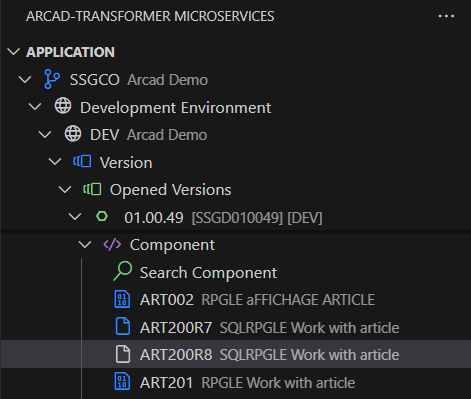
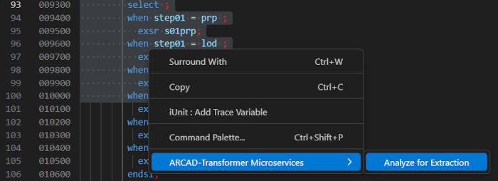
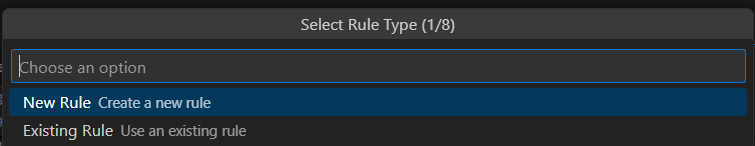
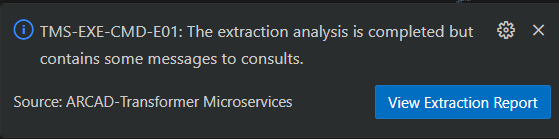

# Analyzing Code Before Extraction  

Using the Transformer Microservices enxtension, you can efficiently analyze code portions using a specific rule, before performing an extraction.  

Each extraction analysis allows you to review the results of the process, once it is completed. These analyses can be accessed in the Extraction Analyses section of the rule's editor.

## Launch a Code Analysis  

> **Step 1:** Open a component that contains the code to analyze by clicking on it.

> **Step 2:** Select the code you want to analyze within the page.

> **Step 3:** Right-click on the selected code and click **Analyze for Extraction**.

  
> **Step 3:** Select the **Rule** to base the analysi on.

There are two ways to set a rule.

| Create a new Rule | Use an existing Rule |
| ----------------- | ----------------- |
| Define the new Rule's **Name**, select an **Project** from the ones available in the list or create a new one, set a description of the Rule, choose the analysis type: `PGM` (Program) or `SRVPGM` (Service Program) and then press **Enter** to launch the analysis. | Select a Rule from the existing ones in the list, set a description and then  |

> **Step 4:** Choose the analysis type:  
   - `PGM` (Program) or
   - `SRVPGM` (Service Program)

Press **Enter** to launch the analysis.

Once the analysis is complete, you are notified of its status and prompted to check the results.

The **Extraction Report** window displays the analysis status, including the equivalent IBM i command execution.  

## Viewing Results  

After the analysis is completed, the bottom panel contains three tabs specific to Transformer Microservices:  

- **Problems**: lists existing errors in an extracted code in the file.  
- **Microservices Problems**: displays errors resulting from the extraction analysis.  
- **Microservices I/O Runtime Paths**: shows runtime input/output paths observed during execution.  

These insights help you review and refine the extraction process.  
