# Application, Component, Environment & Version Setup

This page covers the core setup workflow for a new TMS project directly from the TMS explorer in VSCode: declaring an application, adding a component to it, creating an environment, and opening a version.  

> **Reference**
> For more information on how to create a web server (optionally with SSL/TLS), refer [Web Services Servers](web-servers.md).

## Creating an Application

Declaring a new application requires the following parameters:

| Parameter | Description |
|---|---|
| Application code | *[Mandatory]* Sets a unique identifier for the new application. |
| Description | *[Mandatory]* Sets a short description of the application. |
| Application manager | By default, this option is set to the current IBM i user profile. |
| ASP group | Sets the ASP group. Bu default, the value is set to `*SYSBAS`. |
| Library prefix | *[Mandatory]* Sets the library prefix used to derive the application's library names. |
| Operational libraries | *[Mandatory]* Sets the list of operational libraries. Enter one library name per line (example: data, source and object libraries). |

**Step 1** In the TMS explorer, under **APPLICATION**, click the **+** icon (or right-click) and select **Declare a new Application** to open the **Declare a new Application** panel.

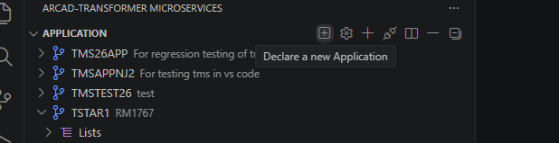

**Step 2** Enter an **Application code** and **Description** (both parameters are required), confirm the **Application manager** and **ASP group**, then set the **Library prefix** and the **Operational libraries** (enter one library per line).

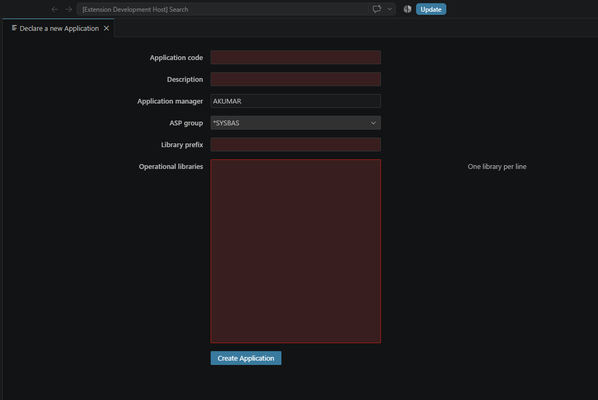

> **Example**  
> Application code: `TSTAR4`  
> Description: `TETS`  
> Application manager: `AKUMAR`  
> ASP group: `*SYSBAS`  
> Library prefix: `AN91`  
> Operational libraries: `AN91_DTA`, `AN91_SRC`, `AN91_OBJ`.

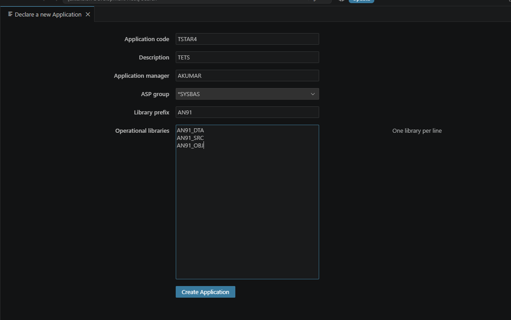

**Step 3** Click the **Create Application** button.

**Result** A confirmation notification is displayed in the VSCode notification area.

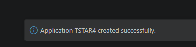

## Creating a Component

Creating a component walks through a guided, multi-step command that accepts:

| Parameter | Description |
|---|---|
| Component name | Mandatory identifier for the new component. |
| Component description | Optional, 50 characters maximum. |
| Type | The object type to create, chosen from a filterable list (example: `*BNDDIR`, `*DTAARA`, `*MSGF`, `*QMFORM`, `BND`, `CBL`, `CLLE`, `CMD`, `DSPF`, `ILEPGM`, `ILESRVPGM`, `INDEX`, `LF`, `MENU`, `PF`, `PNLGRP`, `PRTF`, `RPG`, `RPGLE`, `RPGLEINC`, `SQLMASK`, `SQLPRC`, `SQLRPGLE`, `SQLSEQ`, `SQLTRG`, `SQLUDF`, `SQLVAR`, `SYSTRG`, `TABLE`, `VIEW`). |
| Object type | For ILE types (example: `RPGLE`), whether the component is a `*MODULE` or a `*PGM`. |
| Source file | The source physical file the member is created in (example: `QRPGLESRC`). |

**Step 1** Under the application, expand **Component**, click the **+** icon next to the target library filter and select **Create Component** (as opposed to **Create Object**).

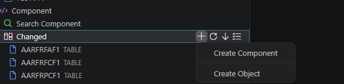

**Step 2** Enter the **Component Name**.

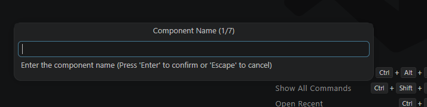

> **Example:** `TSTRPG`

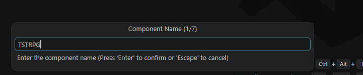

**Step 3** Enter an optional **Component Description**, 50 characters maximum.

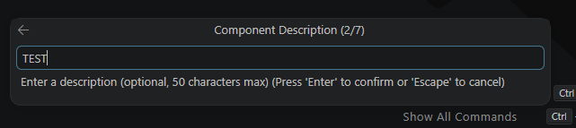

**Step 4** Choose the object type to create from the filterable list.

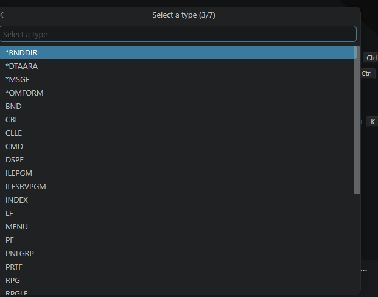

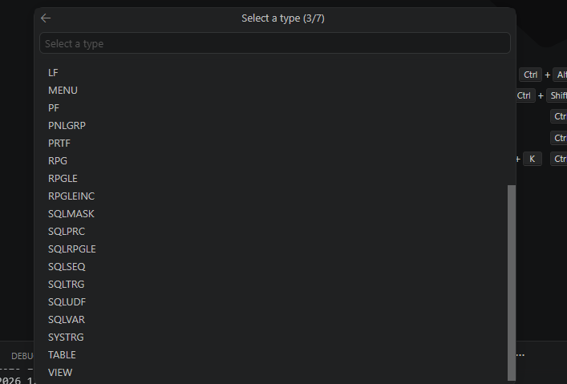

Typing filters the list, example: entering `RPGLE` narrows it to `RPGLE`, `RPGLEINC`, and `SQLRPGLE`.

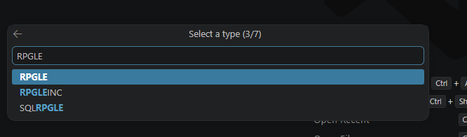

**Step 5** For ILE types such as `RPGLE`, select whether the component is a `*MODULE` or a `*PGM`.

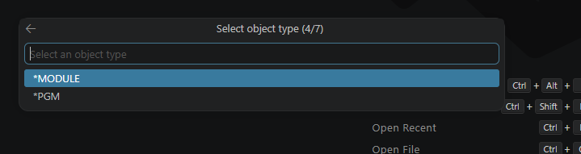

**Step 6** Select the source file the member is created in, example: `QRPGLESRC`. The wizard steps through the remaining prompts before submitting the request.

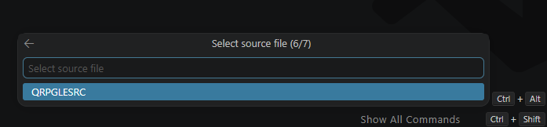

**Result** Once the wizard completes, a confirmation notification is displayed in the VSCode notification area.

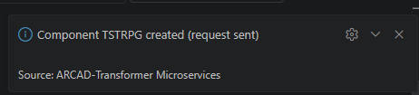

## Creating an Environment

Creating an environment requires an environment code and accepts the following parameters:

| Parameter | Description |
|---|---|
| Environment code | *[Mandatory]* Sets the identifier for the new environment. |
| Description | Sets a short description of the environment. By default, this option is set to *environment*. |
| Library prefix | Sets the prefix of the library. By default, this option is set to `*DFT`, but this value is not authorized on every setup: it must be changed if the creation fails. |
| Site | By default, the site is set to `*LCL`. |
| Environment type | Sets the type of environment to create. (example: `*DEV`, `*TST`). |
| Implementation type | Sets the type of implementation for the new environment. (example: `*EXT`, `*NRM`). |
| Delivery server | Sets whether the environment is usable by the Deliver Server or not. |

**Step 1** In the TMS explorer, right-click the **Environment** node and select **Create Environment** from the context menu.

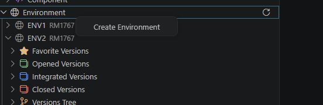

**Step 2** The **Create a new Environment** panel opens. Enter an **Environment code**, an optional **Description**, and enter the **Library prefix**, **Site**, **Environment type**, **Implementation type**, and **Delivery server** as needed.

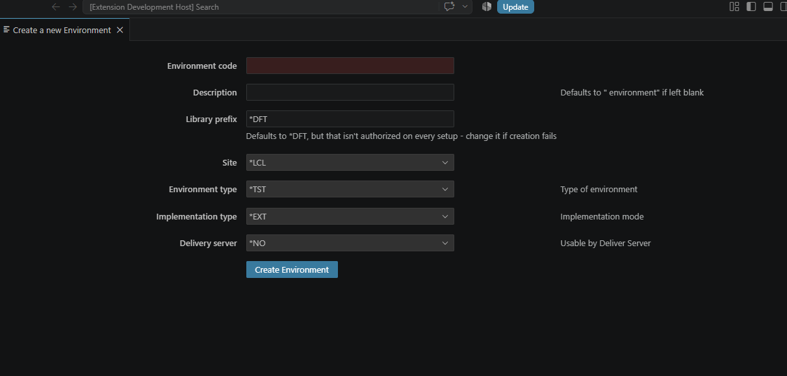

> **Example**  
> Environment code:  `TESTENV`  
> Description:  `TETS`  
> Library prefix:  `AN64`  
> Site:  `*LCL`  
> Environment type:  `*DEV`  
> Implementation type:  `*NRM`  
> Delivery server:  `*NO`.

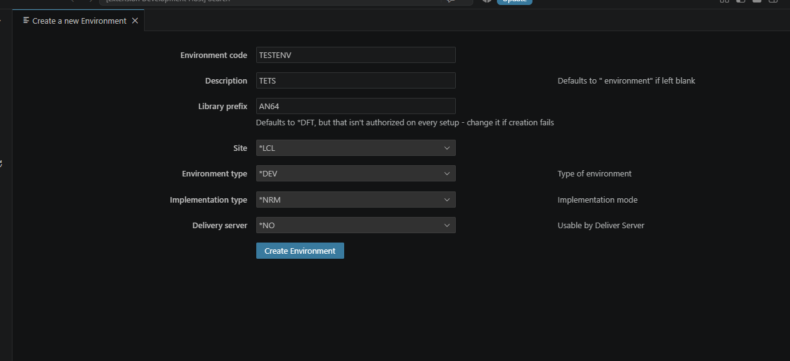

**Step 3** Click **Create Environment**.

**Result** A confirmation notification is displayed in the VSCode notification area.

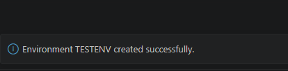

## Opening a Version

Opening a version requires selecting the target application/environment and accepts the following parameters:

| Parameter | Description |
|---|---|
| Version type | Sets a type of version. (example: `*RELEASE`). |
| Description and Status | Sets a short description and an initial status. By default, this option is set to `OPEN`. |
| Increment | Sets a rule for version numbering, or a Custom version number when Increment is set to Custom. |
| Incremental parameters | Mode, Node version, Parent version. |
| Version type parameters | XRef level, Checkout from reference, Lock objects at checkout, Allow edits, Update XRef, Storage location. |
| Version linking parameters | Sets the linked application and Linked version. By default, these options are set to `*NONE`. |

**Step 1** Under the target environment, expand **Opened Versions**, then right-click and select **Open Version**.

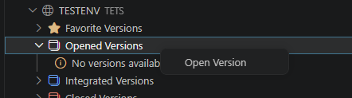

**Step 2** The **Open version** panel opens for the selected application and environment.  
Set the **New version** parameters (Version type, Description, Increment, Custom version, Status), the **Incremental parameters** (Mode, Node version, Parent version), and the **Version type parameters** (XRef level, Checkout from reference, Lock objects at checkout, Allow edits, Update XRef, Storage location).

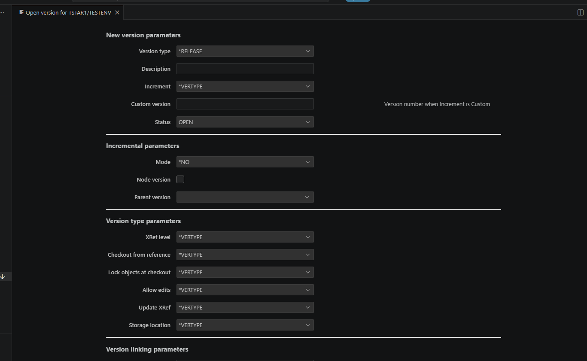

Scroll down to review the **Version linking parameters** (Linked application, Linked version — `*NONE` by default), then click **open**.

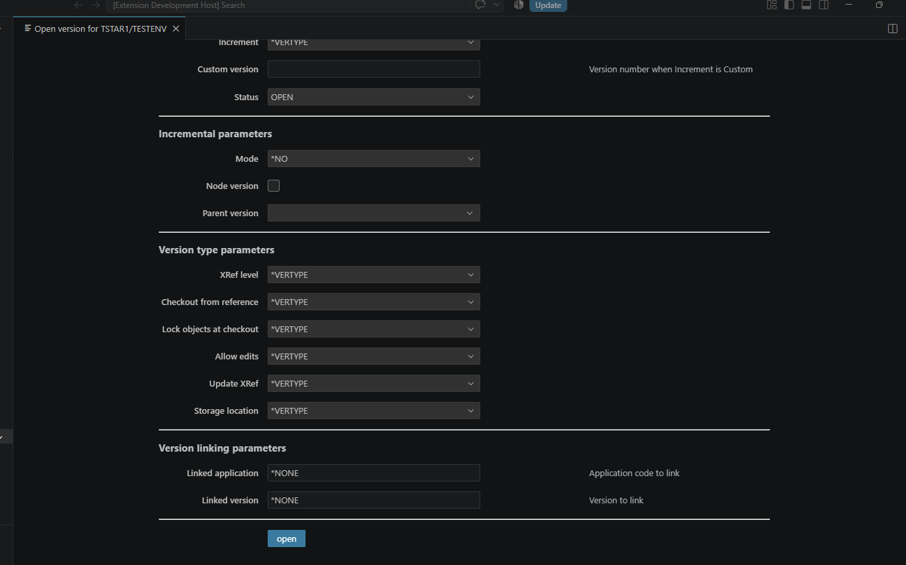

**Result** A confirmation notification is displayed in the VSCode notification area, naming the application, version number, and target environment.

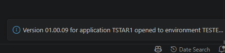
