# Code Similarity Execution

In ARCAD Transformer Microservices, **Code Similarity** refers to analyzing a portion of code to identify similar code blocks within a specific project or an existing extraction.

Each similarity execution displays detailed results to help you review the identified matches.

You can access these analyses from:

- The **Code Similarity** node under the **Projects** node.
- The **Execution History** view by right-clicking an extraction in the **Extraction** or **Externalization** node of the **Rules** node.

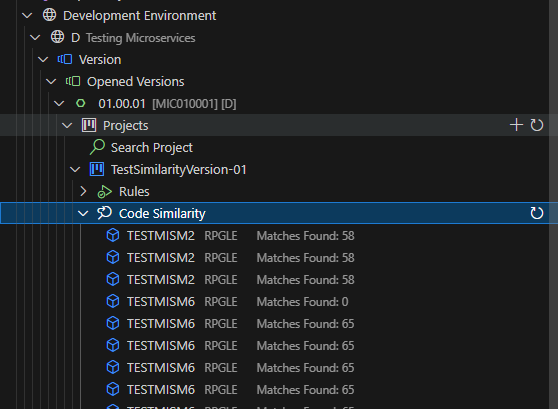  

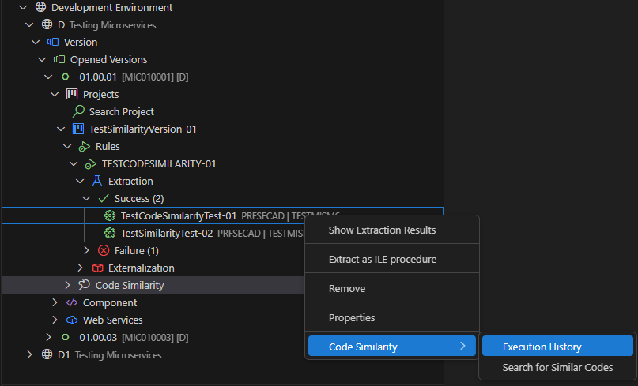

### Execution History

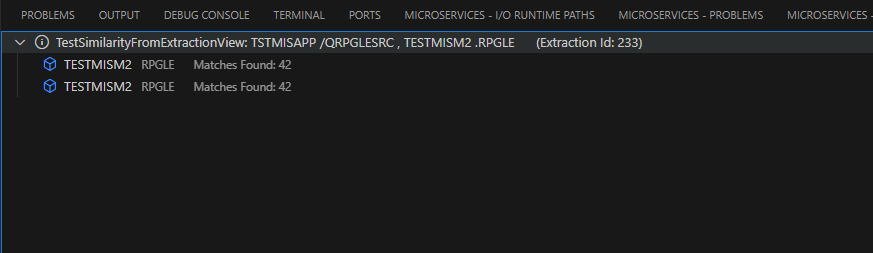

Results appear in the **Microservices Code Similarity Result** view, which summarizes key details where similar code is found.

#### Execution Result

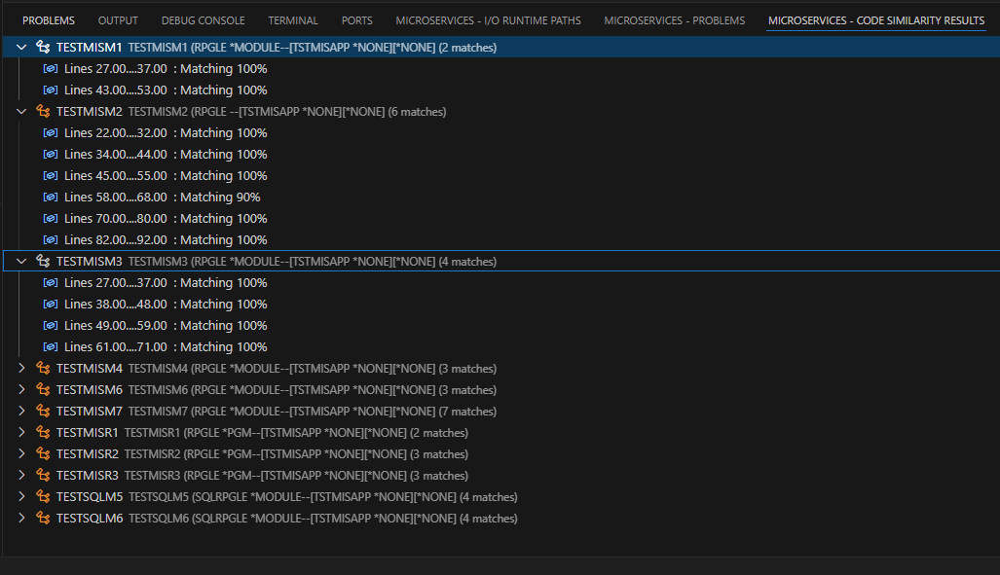

The results view provides details about the following elements:
- Component name, object type, application, environment, and version
- Start and end lines of the similar code block

From the **Similarity Analysis Result**, you can also initiate a new **Code Similarity** search or perform an **Extraction Analysis**.

> **Reference**:  
> For more information about the process behind the code similarity search works, refer to the [Principles of a Code Similarity](code-similarity-principles.md) documentation.

---

## Launching a Code Similarity Analysis From Component

Follow the subsequent steps to launch a Code Similarity analysis from a component.

**Step 1** Open your RPG component from the repository, then select the code block you want to search for similarities.

> [!Note]
> Code Similarity can be executed at the *Repository* level.

> [!Warning]
> Code Similarity can be executed only on **checked out** and **updated** components in the version.

**Step 2** Right-click on the selected code portion and click the **ARCAD Transformer Microservices > Search for similar codes** option.

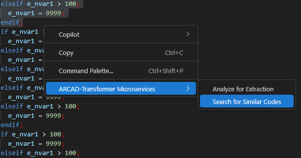  

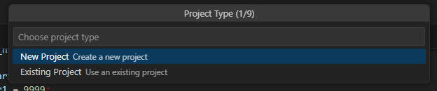

**Step 3** Configure the parameters and fill out the **Code Similarity** settings:

- **Project**: select an ARCAD Transformer Microservices Project from the ones available in the dropdown list. If none exists, click **New Project** to create a new one.
- **Minimum Similarity Match (%)**: set the similarity threshold (1–100).

> [!TIP]  
> A 50% match means a 10-line block must share at least 5 lines with another block to be determined as similar.

- **Minimum Components Found**: Set how many components must include similar code (1–100).

> [!TIP]  
> If set to 5, results are shown only when similar blocks are found in five or more components.

- **Load Pseudocode**: choose whether to load generated pseudocode during the process.

Press **Enter** to launch the analysis.

---

## Launching a Code Similarity Analysis From Existing Extraction

> [!Note]
> Code Similarity can be executed at the *Repository* level.

> [!Warning]
> Code Similarity can be executed only on **checked out** and **updated** components in the version.

Follow the subsequent steps to search for similar code blocks from an existing extraction analysis.

**Step 1** Expand the **Extraction** or **Externalization** node.

**Step 2** Select an extraction analysis.

**Step 3** Right-click on the analysis and select the **Code Similarity > Search for similar code** option.

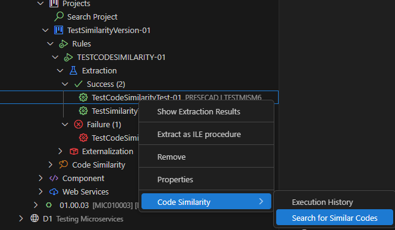

---

## Working with Code Similarity Results

### Navigating Results

After the search completes, you can view and compare pseudocode by right-clicking on a match in the **Code Similarity Results** view and selecting the **Show Compared Pseudocode** option.

This opens a comparison panel:

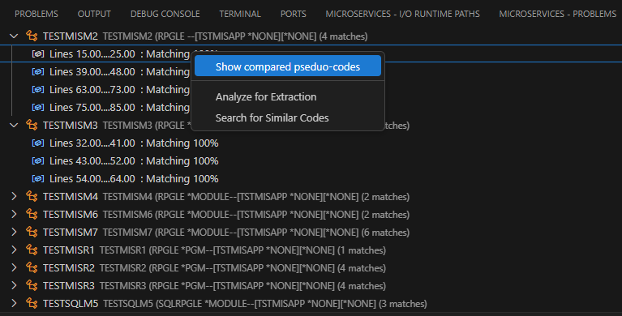  

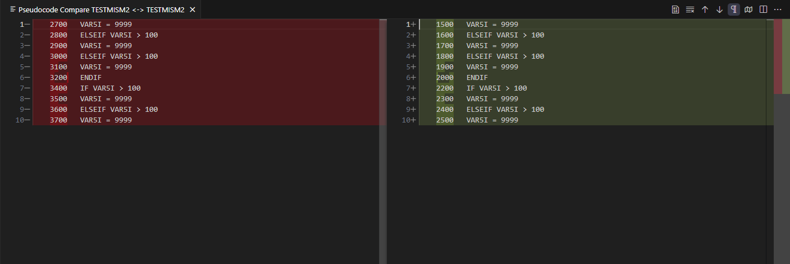

- Left panel: **Source code**
- Right panel: **Compared code**

You can reopen a result by right-clicking and selecting **Open**, or re-execute it by clicking on the **Execute** button.

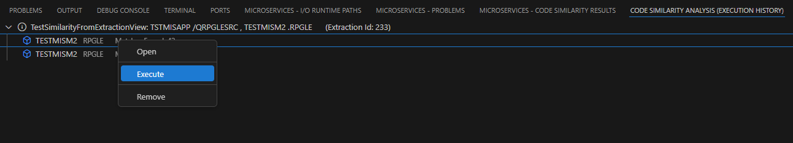  

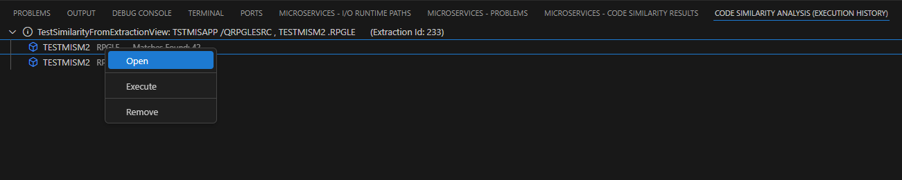

### Launching Additional Searches

To run another similarity search based on current findings, you can right-click on a match in the results view and select the **Search for Similar Codes** option.

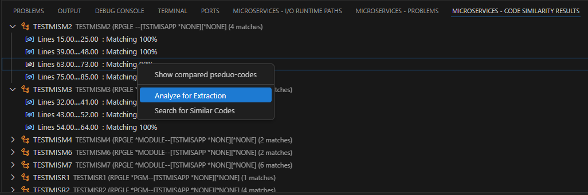

### Running an Extraction Analysis

You can also perform an **Extraction Analysis** by right-clicking on a match in the results and selecting the **Analyze for Extraction** option.

> **Reference**:  
> For more information, refer to the [Extraction Analysis](analyze-code.md) documentation.

---

## Deleting a Code Similarity Search

> [!WARNING]  
> Deleted similarity searches cannot be recovered.

To delete a Code Similarity search, expand the **Project** node > **Code Similarity**, right-click on the code similarity search to delete and click on  **Remove**.

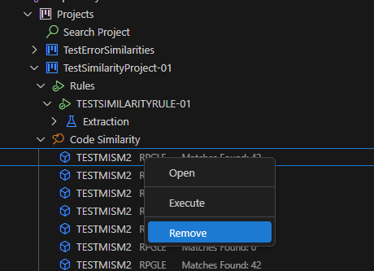

To delete a Code Similarity search from an extraction view, expand the **Extraction** node, right-click and select **Code Similarity** > **Execution History**. Right-click on a result and click on **Remove**.

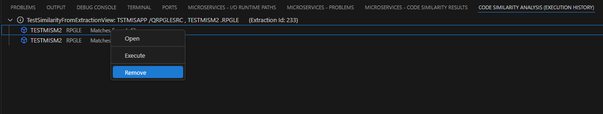
