# Externalization Overview

Externalization qualifies the process that helps the developer to extract the audited code, under an extraction analysis, from the origin source to a new component as an ILE procedure.  
This process requires configuring and customizing several aspects of the procedure beforehand.

These aspects include:

- Setting the name of the externalization
- Defining the name, keyword, and order of the parameters
- Setting the prototype name
- Defining the name of the generated component containing the externalized code
- Selecting the type of ILE object to be created

Once these configurations are complete, the dedicated automation process can be launched.  
This automation process is completed in two steps:

1. **Recalculating** the extraction to ensure its relevance based on the customized configuration
2. **Applying** the modifications to the designated ARCAD version as specified by the Microservice Rule

---

> [!Warning]
> Externalization can **only be performed at the version level**: it is **not possible to execute an externalization at the repository level**.  
> This is because the changes are version-specific and are applied only to the ARCAD version selected during the configuration phase.

## Configuring and Launching an Externalization

Follow the subsequent steps to configure and launch an externalization:

**Step 1** Right-click on an extraction to externalize to open the contextual from the section *Extraction* in the Rules View.

**Step 2** Click on the **Extract as ILE procedure** option to start customizing the procedure to create.

 

**Step 3** From the *Procedure Naming* window, specify the naming of the procedure.

Click **Next** when the procedure name is configured.

For each parameter, you can:

- **Edit** the name and keyword using the *Edit* icon.
- **Change the order** using the *Up* and *Down* icons.

> **Reference**  
For more information about modifying parameters, refer to the [Editing Parameters](#editing-parameters) section.

Click **Save**.

**Step 4** Define the Components, ProtoType and Bindings for the Externalization

From the *Procedure Components* page, define the **Name**, **Type**, and **Source File** for every new component created. 

Complete the following parameters.

**Component**

|Parameter | Description |
|--- | ---|
| Name | Provide a unique name for this component. |
| Type | Select the appropriate component type from the available options (example:, `RPGLE`). |
| Source File | Choose the source file from the drop-down list, which will be populated based on your ARCAD application topology.|

**Prototype**

|Parameter | Description |
|--- | ---|
| Name | specify a meaningful name for the prototype. |
| Type | typically, this is set as `Prototype`. |
| Source File | select the relevant source file for the prototype from the dropdown options.|

**Binding**

|Parameter | Description |
|--- | ---|
| Name | Assign a unique name to the binding object. |
| Type | Choose the binding type:   - `PGM`: Program type binding   - `SRVPGM`: Service Program binding |
| Description  | Optionally, provide a description for the binding object. |

> [!TIP]
- **Service Program Selection** (Version 1.0.3+):
  - For `SRVPGM` type bindings, you can now choose from:
    - **Create New Service Program** - Generate a new SRVPGM
    - **Use Existing Service Program** - Select from existing SRVPGM objects in your environment
  - When selecting an existing Service Program, ensure it matches your externalization requirements

> [!TIP]
> **Service Program Selection Feature (V1.0.3)**  
> The ability to select existing Service Programs (SRVPGM) provides greater flexibility in externalization workflows. You can now:
> - Reuse existing service programs instead of creating duplicates
> - Simplify binding management by leveraging current infrastructure
> - Reduce code duplication and maintenance overhead

> [!Warning] 
> The options for **component types** and **source files** are populated automatically from your ARCAD application topology.  
> Make sure that the correct association between source files and their corresponding types is verified to avoid issues during the generation process.

> **Reference**   
> For more information about editing generated components, refer to the **Editing Generated Components** section.

Click **Finish** to launch the externalization execution process.

> [!Note]
> All configuration changes are automatically saved.

> [!Warning] 
> The externalization execution process starts by performing a new code extraction analysis based on the parameters used in the original code analysis.  
> Once this analysis is successfully validated, the process proceeds to the second step: creating and applying the necessary modifications to the target ARCAD version.

---

## Editing Parameters

When editing the parameters, you can customize the following:

- **Order:** Click the *Up* or *Down* icons to adjust the position of a parameter.
- **Name and Keyword:** Click the *Edit* icon to open the editor, then define a new name and select a new keyword.

### Parameter Naming Configuration (Version 1.0.4+)

When externalizing a code block from a legacy RPG program, parameter names were previously derived directly from the original host field names as-is. Since legacy programs mix several naming styles — short uppercase fields (`CUSNO`), underscore names (`WRK_AMT`), special characters (`$TOTAL`), mixed case (`wrkAmt`) — this produced a differently styled procedure interface for every extraction.

A project-level **naming template** now lets you standardize generated parameter names automatically:

| Setting | Description |
|---|---|
| **Prefix Name** | Literal prefix prepended to every generated parameter name (example: `p_`) |
| **Suffix Name** | Literal suffix appended to every generated parameter name (example: `_in`) |
| **Case Format** | Case convention applied to the base name: `camelCase`, `PascalCase`, `UPPERCASE`, `lowercase`, `snake_case`, `UPPER_SNAKE_CASE` |

Each generated name is built as `<prefix> + <base name converted to the selected case format> + <suffix>`. The base name is tokenized from the original field name — underscores, case transitions, and the RPG special characters `$ # @` are treated as token boundaries — before the case rule is applied.

> **Example** (prefix `p_`, camelCase): `WRK_AMT` → `p_wrkAmt`

> [!NOTE]
> If no template is defined on the project, the previous behavior applies unchanged: the name is derived directly from the original field. Once a template is configured, consecutive underscores (`_`, `__`, etc.) are no longer allowed in a parameter name; without a template, consecutive underscores remain permitted.

#### Configuring the Naming Template

**Step 1** In the TMS Projects tree view, right-click the target project and select **Configure Parameter Naming** from the context menu.

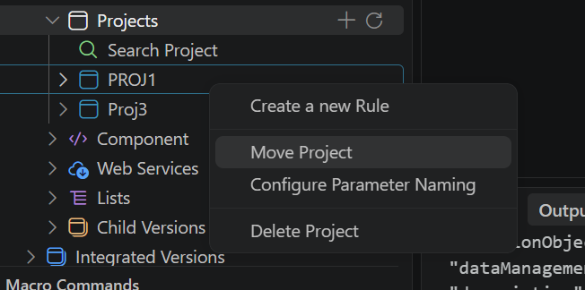

**Step 2** In the **Configure Parameter Naming** panel, enter a **Prefix Name** and/or a **Suffix Name** (at least one of the two is required) and choose a **Case Format** from the dropdown.

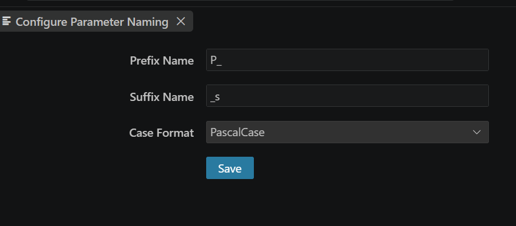

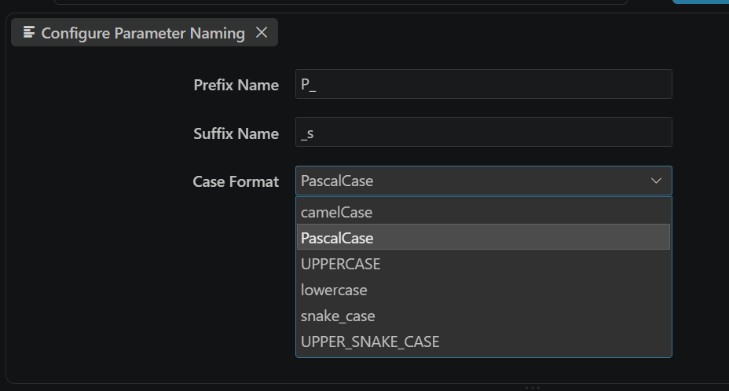

**Step 3** Click **Save**.

**Result** A success or error notification is displayed in the VSCode notification area (bottom-right) confirming whether the template was saved. The template applies to all extractions performed under that project.

#### Validating Parameter Names During Externalization

Once a naming template is configured at project level, three extra actions appear next to each parameter in the **Manage Externalization Parameters** dialog:

- **Validate** — applies the naming convention to the selected parameter only.
- **Validate All** — applies the naming convention to every parameter in the list.
- **Default** — reverts the parameter name back to the original, pre-template value.

Suggested names can also be edited manually in-line; the field updates dynamically as you type.

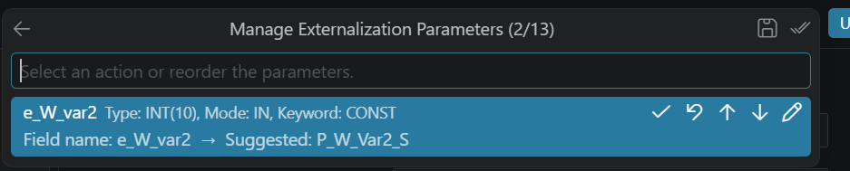

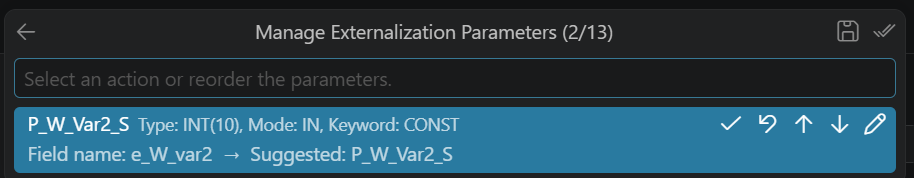

**Result** The generated ILE procedure interface reflects the validated/corrected parameter names.

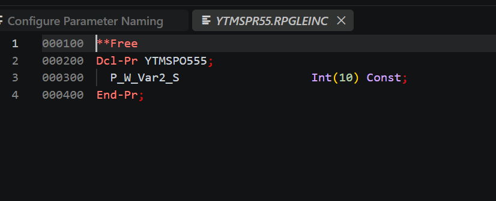

> [!NOTE]
> This applies to both simulated and externalized procedures — violations are visible in the simulation preview before any code transformation is committed. Generated names remain valid RPG identifiers; length limits and name collisions after normalization are validated.

> [!Warning]
> The keyword drop-down list includes only the keywords managed by the externalization process:  
> - `RETURN`: The return value is treated as a reference-type parameter.  
> - `CONST`: A temporary copy is created and passed by address.  
> - `VALUE`: The parameter is passed by value.

---

## Editing Generated Components

You can edit three entities:

1. **Component:** Contains both the procedure interface and calculation specifications.
2. **Prototype:** Contains the prototype definition.
3. **Binding:** The ILE program or service program object created.

Each should include:

- A unique name and/or description
- A selected component type
- A source file from the drop-down list

> [!note]
> The type and source file parameters are populated based on your ARCAD application topology.

> [!Warning] 
> Make sure that the association between source files and their source types is correct to avoid issues.

---

## Externalization Results

### Understanding the Externalization Results

After completion, the extraction analysis icon is updated based on the result status. You may encounter various errors related to the execution of the steps. These errors are typically displayed in the **Microservices Problem-Panel** view and can include :

| Icon | Status  | Description  |
|------|---------|              |            
| ❌  | Recalculation failure  | The recalculation step fails, the extraction cannot proceed, and no ILE generation occurs.  |
| ⚠️  | Generation failure or abortion| The recalculation step succeeds, but the generation step fails or is aborted. |
| ✅  | Successful completion | If both steps are successful, the externalization is successfully completed. |

To review results, open the **Component Version** view for the designated ARCAD version and locate your components.

### Error Handling Steps

1. **Verify your configuration**: make sure that all the parameters and components are configured correctly, including names, types, and source files.   
2. **Review Logs**: open the **Microservices Problem-Panel** view to inspect logs and identify any errors that occurred during the recalculation or generation steps.
3. **Retry the Process**: if any errors are identified, adjust your configuration as needed and retry the externalization process.

> [!Note] 
> Errors related to the configuration should be resolved before restarting the externalization to avoid repeated failures.  
Check the error descriptions for specific guidance on resolving issues.

---

## Deleting an Externalization Result

An externalization result is linked to an extraction analysis.

To delete it, delete the corresponding extraction analysis.

> [!Warning]   
> Deleting an externalization result does **not** undo changes made to original/generated components.  
> You must **manually remove** those changes.

---

## Creating an iUnit Test Case (Version 1.0.4+)

You can now create and run an **iUnit** test case directly from a successful externalization, without leaving VSCode. The test case can be created, populated with expected results, executed, and reviewed entirely from within the TMS and iUnit extensions.

> [!NOTE]
> **Prerequisites**  
> - Install (or update to) the latest **ARCAD-Transformer Microservices** and **ARCAD-iUnit** extensions in VSCode. Open [ARCAD-iUnit](https://marketplace.visualstudio.com/items?itemName=arcadsoftware.arcad-iunit) from the Marketplace if it isn't installed yet.
> - Set up the connection on both the Transformer Microservices and iUnit extensions (application/environment/version).
> - Load the target repository in iUnit.
> - Have a successful externalization available (a rule with an **Externalization → Success** result).

### Step 1 - Create a Test Case

In the **Rules** node, navigate to **Rules > (rule) > Externalization > Success**, then right-click one of the successful externalization entries. Under **Actions**, expand **iUnit** and select **Create Test Case** (the same menu offers **Show Test Cases** for entries that already have one).

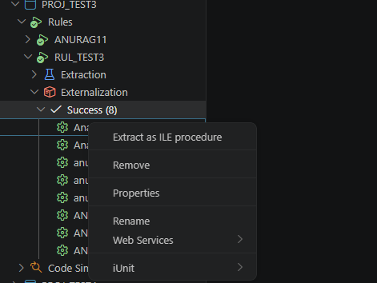

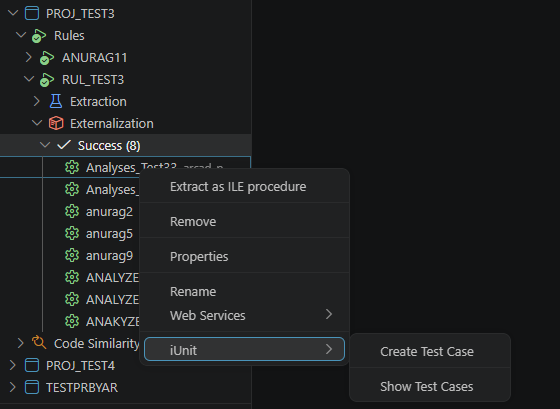

If more than one repository is linked to the application/environment/version, a picker prompts for which repository the test case should be created in.

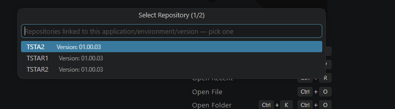

A default test case name is proposed, built from the object and procedure names plus a timestamp. It can be edited before confirming with **Enter**.

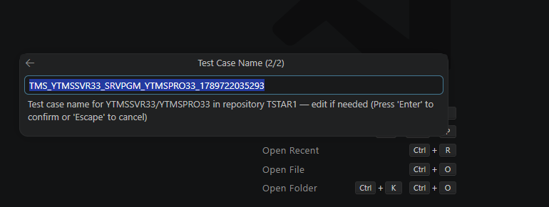

**Result** A notification confirms the test case was created and offers to open the iUnit Explorer directly.

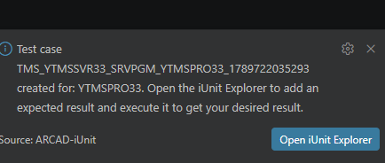

### Step 2 - Show Test Cases

Selecting **Show Test Cases** (or **Open iUnit Explorer** from the notification) opens a **Test Cases** view listing every test case defined for that object across all repositories, with its repository, application, environment, version, test case name, object name/type, linked procedure name, last execution date, and result count.

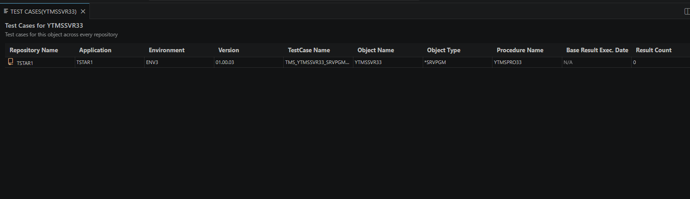

### Step 3 - Create Expected Result

Right-click a test case row to access **Create Expected Result**, **Execute**, **Show Results**, and **Delete**.

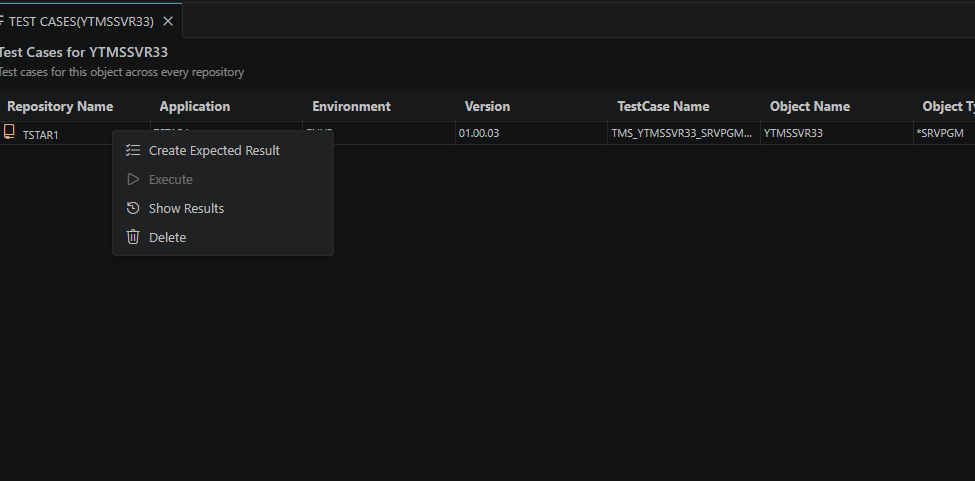

**Create Expected Result** opens an editable grid with one row per procedure parameter (name, data type). For each parameter, set the **Input Method** and **Input Value** to use for the run, then the **Operator** and, where applicable, the **Expected Value** / **Output Method** the actual result must satisfy. Confirm with **Create Mode** to save the expected result.

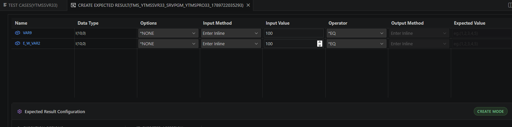

### Step 4 - Execute

Selecting **Execute** from the test case context menu runs the linked procedure with the configured input values and compares the actual output against the expected result. The **Test Execution Result** view lists each parameter with its type, input, expected value, operator, and actual value, with a check mark where the comparison passes.

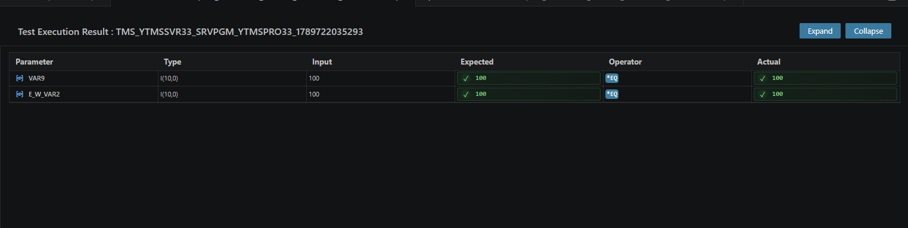

### Step 5 - Show Results

**Show Results** (from the test case context menu) opens the full result view: a **Result Identification** panel (test case name, procedure name) and an **Execution History** list of past runs by date/time on the left, with the corresponding parameter comparison table on the right for the selected run.

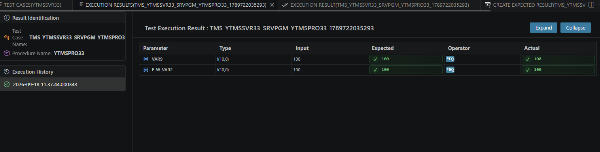

> [!TIP]
> End-to-end, this lets you go from a successful externalization to a validated, repeatable iUnit test in one continuous flow: **Create Test Case → Show Test Cases → Create Expected Result → Execute → Show Results**.
