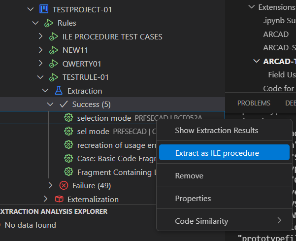
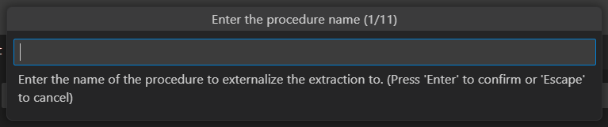
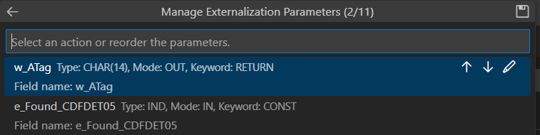

# Externalization Overview

Externalization qualifies the process that helps the developer to extract the audited code, under an extraction analysis, from the origin source to a new component as an ILE procedure.  
This process requires configuring and customizing several aspects of the procedure beforehand.

These aspects include:

- Setting the name of the externalization
- Defining the name, keyword, and order of the parameters
- Setting the prototype name
- Defining the name of the generated component containing the externalized code
- Selecting the type of ILE object to be created

Once these configurations are complete, the dedicated automation process can be launched.  
This automation process is completed in two steps:

1. **Recalculating** the extraction to ensure its relevance based on the customized configuration
2. **Applying** the modifications to the designated ARCAD version as specified by the Microservice Rule

---

> [!Warning]
> Externalization can **only be performed at the version level**: it is **not possible to execute an externalization at the repository level**.  
> This is because the changes are version-specific and are applied only to the ARCAD version selected during the configuration phase.

## Configuring and Launching an Externalization

Follow the subsequent steps to configure and launch an externalization:

**Step 1** Right-click on an extraction to externalize to open the contextual from the section *Extraction* in the Rules View.

**Step 2** Click on the **Extract as ILE procedure** option to start customizing the procedure to create.

 

**Step 3** From the *Procedure Naming* window, specify the naming of the procedure.

Click **Next** when the procedure name is configured.

For each parameter, you can:

- **Edit** the name and keyword using the *Edit* icon.
- **Change the order** using the *Up* and *Down* icons.

> **Reference**  
For more information about modifying parameters, refer to the [Editing Parameters](#editing-parameters) section.

Click **Save**.

**Step 4** Define the Components, ProtoType and Bindings for the Externalization

From the *Procedure Components* page, define the **Name**, **Type**, and **Source File** for every new component created. 

Complete the following parameters.

**Component**
- **Name**: provide a unique name for this component.
- **Type**: select the appropriate component type from the available options (e.g., `RPGLE`).
- **Source File**: choose the source file from the drop-down list, which will be populated based on your ARCAD application topology.

**Prototype**
- **Name**: specify a meaningful name for the prototype.
- **Type**: typically, this is set as `Prototype`.
- **Source File**: select the relevant source file for the prototype from the dropdown options.

**Binding**
- **Name**: assign a unique name to the binding object.
- **Type**: Choose the binding type:
  - `PGM` - Program type binding
  - `SRVPGM` - Service Program binding
- **Service Program Selection** (Version 1.0.3+):
  - For `SRVPGM` type bindings, you can now choose from:
    - **Create New Service Program** - Generate a new SRVPGM
    - **Use Existing Service Program** - Select from existing SRVPGM objects in your environment
  - When selecting an existing Service Program, ensure it matches your externalization requirements
- **Description**: Optionally, provide a description for the binding object

> [!TIP]
> **Service Program Selection Feature (V1.0.3)**  
> The ability to select existing Service Programs (SRVPGM) provides greater flexibility in externalization workflows. You can now:
> - Reuse existing service programs instead of creating duplicates
> - Simplify binding management by leveraging current infrastructure
> - Reduce code duplication and maintenance overhead

> [!Warning] 
> The options for **component types** and **source files** are populated automatically from your ARCAD application topology.  
> Make sure that the correct association between source files and their corresponding types is verified to avoid issues during the generation process.

> **Reference**   
> For more information about editing generated components, refer to the **Editing Generated Components** section.

Click **Finish** to launch the externalization execution process.

> **Note:** 
> All configuration changes are automatically saved.

> [!Warning] 
> The externalization execution process starts by performing a new code extraction analysis based on the parameters used in the original code analysis.  
> Once this analysis is successfully validated, the process proceeds to the second step: creating and applying the necessary modifications to the target ARCAD version.

---

## Editing Parameters

When editing the parameters, you can customize the following:

- **Order:** Click the *Up* or *Down* icons to adjust the position of a parameter.
- **Name and Keyword:** Click the *Edit* icon to open the editor, then define a new name and select a new keyword.

> [!Warning]
> The keyword drop-down list includes only the keywords managed by the externalization process:  
> - `RETURN`: The return value is treated as a reference-type parameter.  
> - `CONST`: A temporary copy is created and passed by address.  
> - `VALUE`: The parameter is passed by value.

---

## Editing Generated Components

You can edit three entities:

1. **Component:** Contains both the procedure interface and calculation specifications.
2. **Prototype:** Contains the prototype definition.
3. **Binding:** The ILE program or service program object created.

Each should include:

- A unique name and/or description
- A selected component type
- A source file from the drop-down list

> [!note]
> The type and source file parameters are populated based on your ARCAD application topology.

> [!Warning] 
> Make sure that the association between source files and their source types is correct to avoid issues.

---

## Externalization Results

### Understanding the Externalization Results

After completion, the extraction analysis icon is updated based on the result status. You may encounter various errors related to the execution of the steps. These errors are typically displayed in the **Microservices Problem-Panel** view and can include :

| Icon | Status  | Description  |
|------|---------|              |            
| ❌  | Recalculation failure  | The recalculation step fails, the extraction cannot proceed, and no ILE generation occurs.  |
| ⚠️  | Generation failure or abortion| The recalculation step succeeds, but the generation step fails or is aborted. |
| ✅  | Successful completion | If both steps are successful, the externalization is successfully completed. |

To review results, open the **Component Version** view for the designated ARCAD version and locate your components.

### Error Handling Steps

1. **Verify your configuration**: make sure that all the parameters and components are configured correctly, including names, types, and source files.   
2. **Review Logs**: open the **Microservices Problem-Panel** view to inspect logs and identify any errors that occurred during the recalculation or generation steps.
3. **Retry the Process**: if any errors are identified, adjust your configuration as needed and retry the externalization process.

> [!Note] 
> Errors related to the configuration should be resolved before restarting the externalization to avoid repeated failures.  
Check the error descriptions for specific guidance on resolving issues.

---

## Deleting an Externalization Result

An externalization result is linked to an extraction analysis.

To delete it, delete the corresponding extraction analysis.

> [!Warning]   
> Deleting an externalization result does **not** undo changes made to original/generated components.  
> You must **manually remove** those changes.
