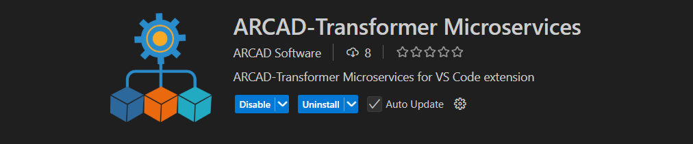

# ARCAD-Transformer Microservices for VSCode extension

Welcome to the **ARCAD Microservices Extension for VSCode** Documentation!

ARCAD Transformer Microservices is an integral tool in the process of modernizing legacy applications by honing in on specific sections of code that possess unique characteristics.

The emphasis on uniqueness in code sections allows for a gradual evolution of application architecture from monolithic to modular, paving the way for the implementation of highly relevant architectures like microservices.
Adopting a microservices architecture offers a myriad of benefits to both developers and enterprises:

For developers, the implementation of microservices architecture offers several significant advantages.  
By avoiding the accumulation of a large code base, it simplifies the maintenance and the addition of new features. It also enhances deployment processes and reduces IDE load times.  
Additionally, debugging becomes more straightforward, and tracking code dependencies is less cumbersome, facilitating smoother project workflows.

As for enterprises, it enables more frequent deliveries and shorter delivery times, allowing faster feedback cycles.  
It also enhances resource management and improves service availability, ultimately leading to a better user experience. 
Additionally, identifying and eliminating duplicate services can significantly reduce development expenses and operational management costs.

ARCAD Transformer Microservices is designed to facilitate the implementation of such architecture by providing functionalities that support the generation of microservices based on IBM i applications.

To achieve this goal, the product focuses on:
- auditing the risk associated with externalizing a selected portion of code before centralizing it,
- determining where a selected piece of code is used within an application, and
- ensuring the uniqueness of the call to centralized code within the application.
