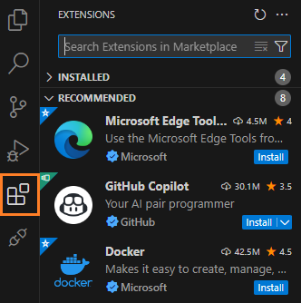
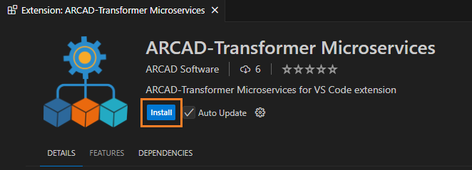
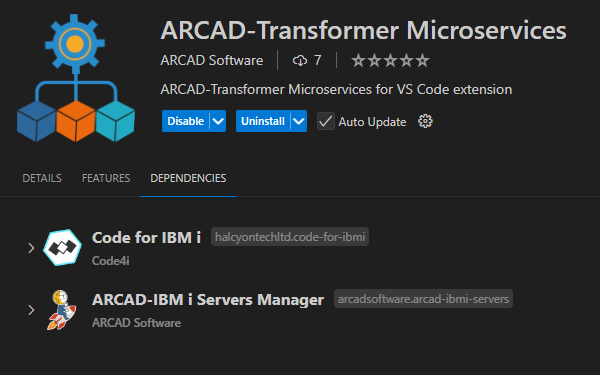

# Installing the extension

## Prerequisites

To ensure that this extension functions properly, it is essential to install the ARCAD Transformer Microservices Server first.  
To proceed with the installation, please refer to the corresponding <a href="ARCAD-TMS_26.0_A4_Installation~Guide.pdf" target="_blank">Server Installation Guide</a>, which contains detailed instructions to help you install and set up the server.

## Download from the Marketplace

The Transformer Microservices VS Code extension is available to download directly from the VSCode Marketplace.  
Use the search bar in your VScode to look for the extension or open it from this [page](https://marketplace.visualstudio.com/items?itemName=arcadsoftware.arcad-microservices).

Click **Install** to launch the installation of the extension. Once it is istalled, the Microservices extension appears in your toolbar.

The Transformer Microservices VS Code extension has two dependencies, meaning it relies on two other extensions to function properly.  
When you install the Transformer Microservices VS Code extension, these dependencies are automatically installed as well and no further action is required on your part.
These two extensions are:

- Code for IBM i,
- ARCAD-IBM i Servers Manager.

Once the extension is successfully installed, you have to set up the connection to the server.  
For more information, refer to the [Server Connection Configuration](/server-connection.md) documentation.
> [!WARNING]
> If you uninstall the **Transformer Microservices** extension from VSCode, these two dependencies are not automatically unistalled.  
However, if you try to unistall one of the dependencies, it automatically uninstalls the **Transformer Microservices** extension from VSCode.
