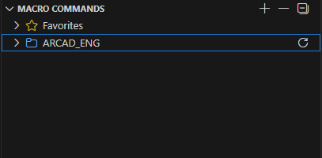
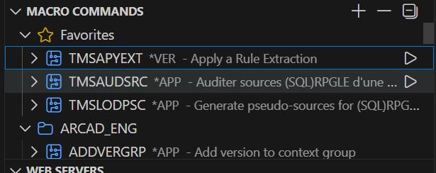
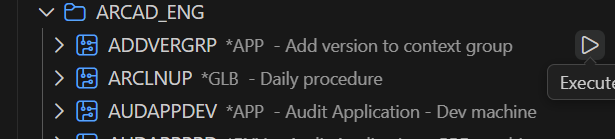
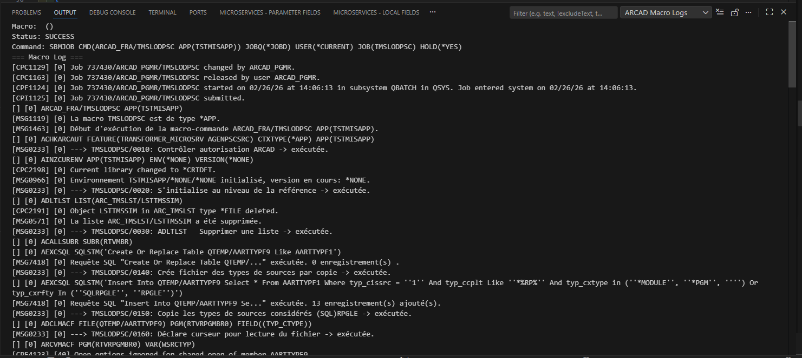

# Macro Commands Management

The **MACRO COMMANDS** feature in ARCAD Transformer Microservices provides users with an efficient way to browse, manage, and execute macro command lists directly from the VSCode explorer. This feature streamlines macro operations with a user-friendly interface and comprehensive management capabilities.

---

## Overview

The **MACRO COMMANDS Explorer** allows users to:
- ✅ Add and manage library lists
- ✅ Browse all macro commands filtered by favorites
- ✅ View macro definitions in JSON format
- ✅ Execute macros directly from the UI
- ✅ Track execution results in real-time

---

## MACRO COMMANDS Explorer

---

## Workflow: Getting Started with Macro Commands

### Step 1: Add Library Lists

**From the Explorer Toolbar:**

**Step 1** Open the **MACRO COMMANDS** node in the ARCAD-Microservices explorer.

**Step 2** Click the **+ (Plus Icon)** in the explorer toolbar next to MACRO COMMANDS.

**Step 3** Select **Add Library List** from the options menu.

**Step 4** Enter the library details:
- Library name
- Library path
- Access permissions

**Step 5** Click **Save** to add the library.

**From the Context Menu:**

**Alternative Step 2** Right-click on **MACRO COMMANDS**.

**Alternative Step 3** Select **Add Library List** from the context menu.

**Result** The library list is added and available in the explorer for macro commands.

---

### Step 1b: Remove Library Lists

**From the Explorer Toolbar:**

**Step 1** Locate the library list you want to remove in the MACRO COMMANDS Explorer.

**Step 2** Click the **- ( Icon)** in the explorer toolbar next to the library.

**Step 3** Confirm the removal when prompted.

**From the Context Menu:**

**Alternative Step 2** Right-click on the library list.

**Alternative Step 3** Select **Remove Library List** from the context menu.

**Alternative Step 4** Confirm the removal.

**Result** The library list is removed from the explorer and the system.

---

### Step 2: View Macro Commands by Favorites

Once library lists are configured, the explorer displays:

**Available Views:**
- **All Macro Commands** - Complete list of all available macros (all will be visible to the user)
- **Favorites** - Filtered view showing only macro commands marked as favorites
  - **Version 1.0.3 Enhancement**: Now includes TMS-related macros and user-marked favorites
  - **Quick Access**: Perfect for finding frequently used TMS macros without scrolling through all available macros
  - **Library-Specific Filtering**: View macros from specific libraries (e.g., ARCAD_ENG) when needed

**User Tips:**
- **For TMS Macros Only**: If you want to see only TMS-related macros, navigate to the **Favorites** view where all TMS macros are readily available
- **For Complete List**: Use **All Macro Commands** view to access every available macro in your configured library lists
- **Note:** Users can see all available macro commands in the **All Macro Commands** view. The **Favorites** view provides quick access to frequently used macros only.

---

### Step 3: View Macro Definition

To view the macro definition in JSON format:

**Option 1: Using the Context Menu**

**Step 1** Locate the macro command in the MACRO COMMANDS Explorer.

**Step 2** Right-click on the macro command.

**Step 3** Select **Open Macro Definition** from the context menu.

**Option 2: Using Double-Click (Version 1.0.3+)**

**Step 1** Locate the macro command in the MACRO COMMANDS Explorer.

**Step 2** Double-click on the macro command.

**Result** The macro definition displays in JSON format showing:
- Macro ID
- Name and description
- Definition details
- Parameters and configuration
- All macro properties and settings

---

### Step 4: Execute Macro Commands

#### Direct Execution

To execute a macro command directly:

**Step 1** Locate the macro command in the MACRO COMMANDS Explorer (preferably from **Favorites** view).

**Step 2** Right-click on the macro command.

**Step 3** Select **Execute** from the context menu.

**Step 4** The system executes the macro and displays:
- Execution status
- Processing progress
- Results and output

**Result** The macro executes successfully and results are displayed.

---

### Step 5: View Macro Execution Logs

After executing a macro command, you can view detailed logs in the **ARCAD Macro Logs** panel:

**Step 1** After macro execution completes, the **ARCAD Macro Logs** panel opens automatically.

**Step 2** Review the logs displaying:
- Execution status (Success/Failed)
- Detailed execution output
- Error messages (if any)
- Processing timestamps
- Performance metrics

**Step 3** Use the logs to:
- ✅ Verify macro execution success
- ✅ Troubleshoot any errors
- ✅ Monitor macro performance
- ✅ Track execution history

**Result** Complete macro execution details are visible in the ARCAD Macro Logs panel.

---

### Macro Execution History (Version 1.0.3+)

After executing macros, you can track execution history to monitor macro performance and results. Follow the subsequent steps to View the Macro Execution History.

**Step 1** Navigate to the **Application** node in your configuration.

**Step 2** Locate the executed macro in the list.

**Step 3** View the execution history indicator next to each macro.

| Column | Description |
| ---    | ----------  |
| Successful Executions | Indicated by a checkmark or success icon. |
| Failed Executions | Indicated by anerror icon. |
| Execution Count | Shows the amount of times a macro was executed. |
| Last Execution | Displays the timestamp of the most recent execution. |

**Step 4** Click on the execution history to view the detailed results. The following elements are displayed:
- Execution date and time,
- Duration of execution,
- Output results, and
- Any errors or warnings.

**Result** The complete execution history is then available for audit and performance tracking purposes.

## Execution Results

After executing a macro command, the explorer displays:

---

## Library Management at Application Level (Version 1.0.3+)

Library lists at the Application level provide organization and access to macros across your entire application configuration. Common library names include `ARCAD_ENG` and other application-specific libraries.

### Adding Library Lists at Application Level

You can add a Library list either by using the **+ (Plus Icon)** in the Macro Commands explorer toolbar or through the Context menu. To do so, navigate to the **Application** node or right-click on it, then select the **Add Library List** option. Enter the Library details (the **Library Name** (for example, `ARCAD_ENG`), the **Library Path**, and the **Access Permissions**), and click **Save** to confirm.

### Removing Library Lists at Application Level

You can remove a Library list either by using the **- (Minus Icon)** or through the Context menu. To do so, locate the library under the **Application** node and click the **- (Minus Icon)** next to it, or right-click on the library list and select the **Remove Library List** option, then click OK to confirm. The library is then removed from the system.

## Best Practices

- **Use Favorites:** Mark frequently used macros as favorites for quick access
- **Organize Libraries:** Keep library lists organized by functionality
- **Review Definitions:** Check macro definitions before execution
- **Monitor Results:** Track execution results for successful completion
- **Document Usage:** Keep records of macro executions for audit trails

---

## Related Features

- **[ARCAD Transformer Microservices](index.md)** - Overview
- **[Rules Management](rule.md)** - Work with extraction rules
- **[Web Services](web-services.md)** - Deploy web services