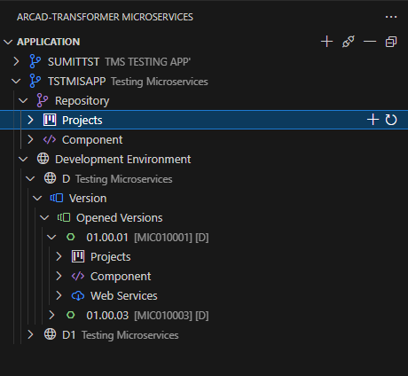
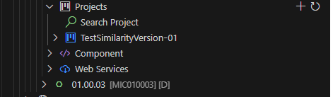
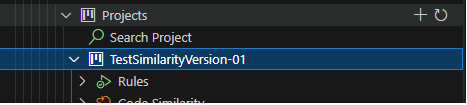
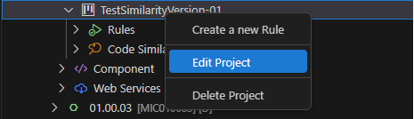
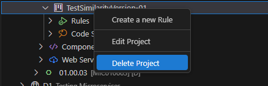

# Projects in ARCAD Transformer Microservices

ARCAD Transformer Microservices Projects play a key role in helping developers identify the correct version of the ARCAD application to use.  
This is essential when performing extraction analysis to ensure the appropriate source level is selected. During externalization, it guarantees that all required components are properly checked out.

You can access and manage ARCAD Microservice Projects under the **Projects** node, located within both the **Repository** and **Version** nodes.  
To view your projects, simply expand the **Projects** node.

---

## Creating a New ARCAD Transformer Microservices Project

Follow the steps below to create a new project:

### **Step 1:** Click the **Add Project** icon.

### **Step 2:** Enter the project's **Name**.  
This is a required field and must be unique.

Press **Enter** to continue and define the ARCAD environment.

### **Step 3:** Select the ARCAD version.  
Choose the application, environment, and version number from the dropdown list.

Press **Enter** to finalize.

> ✅ **Result:** The project is created and will appear under the **Projects** node.

To edit an existing project, right-click the corresponding item and select the **Edit Project** icon. Make the desired changes in the configuration.

---

## Deleting an ARCAD Transformer Microservices Project

> ⚠️ **Warning:** Deleted projects cannot be recovered.

To delete a project, right-click the project in the list and select the **Delete Project** icon.

Click **OK** to confirm the deletion, or **Cancel** to abort the action.
