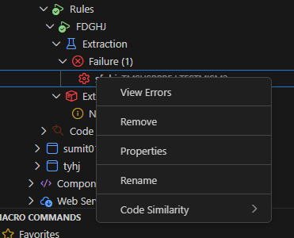
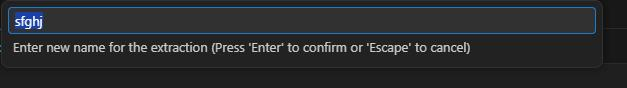

# Renaming Extraction Descriptions

In ARCAD Transformer Microservices, you can update the description of extraction analyses for both successful and failed extractions. This feature allows you to provide meaningful descriptions for your extraction results, making it easier to organize and track your extraction analyses.

---

## Overview

The **Rename Extraction** functionality enables you to update the description of extraction analyses at the **Extraction & Externalization Node Level**. This is particularly useful for:

- Adding meaningful context about the extraction
- Updating extraction descriptions based on review findings
- Managing and organizing multiple extraction analyses
- Tracking changes and improvements made to extractions

> [!NOTE]
> This feature is available at the **Extraction & Externalization Node Level** for:
> - **Extraction Analyses:** Success and Failed Node
> - **Externalization Analyses:** Success, Failure, and Incomplete Node

---

## Renaming an Extraction Description

Follow the subsequent steps to rename or update an extraction description:

**Step 1** Locate the extraction analysis you want to rename in the **Extraction** or **Externalization** section of the **Rules** node.

**Step 2** Right-click on the extraction analysis to open the contextual menu.

**Step 3** Select the **Rename** option from the context menu.

**Step 4** A text input dialog will appear. Enter the new description for the extraction analysis.

**Step 5** Press **Enter** or click **OK** to confirm the new description.

**Result** The extraction description is successfully updated and reflected in the **Extraction** node.

---

## Accessing Renaming Actions

### From the Extraction Node

1. **Successful Extractions:** Located under the **Extraction** section in the **Rules** node.
2. **Failed Extractions:** Also available under the **Extraction** section with a failure indicator.

### From the Externalization Node

The rename action is also available for externalization results:

1. Navigate to the **Externalization** section in the **Rules** node.
2. Right-click on the externalization result.
3. Select **Rename** from the context menu.

---

## Best Practices

- **Use Clear Descriptions:** Provide descriptive names that clearly identify the extraction purpose.
- **Include Context:** Add information about the extraction analysis, such as the business rule or feature being extracted.
- **Update Regularly:** Modify descriptions as extraction analyses progress or after review.
- **Track Changes:** Keep descriptions updated to reflect the current state and any modifications made.

---

## Related Features

- **[Viewing Extraction Analysis Properties](rule.md#viewing-extraction-analysis-properties)** - View all details of an extraction.
- **[Externalizing an Extraction Analysis](externalizations.md)** - Convert extraction to ILE procedure.
- **[Deleting an Extraction Analysis](rule.md#deleting-an-extraction-analysis)** - Remove extraction analyses.
- **[Code Similarity Search](code-similarity.md)** - Find similar code blocks from an extraction.
