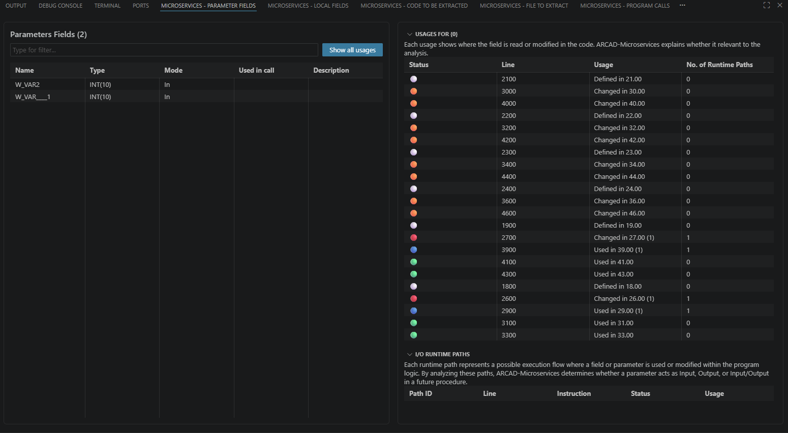
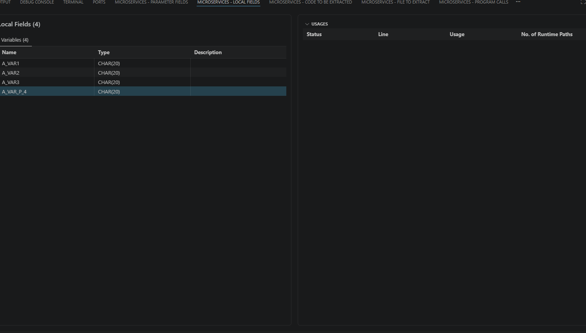
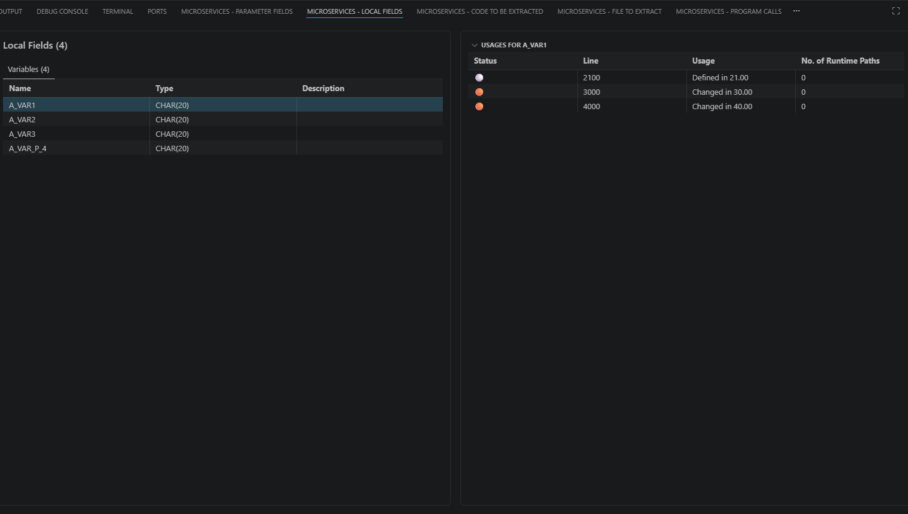
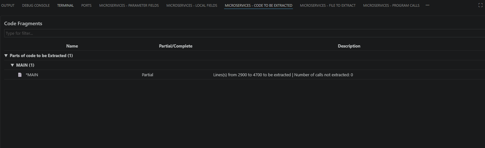
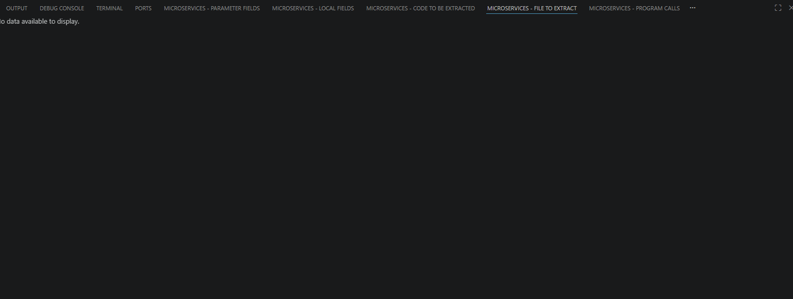
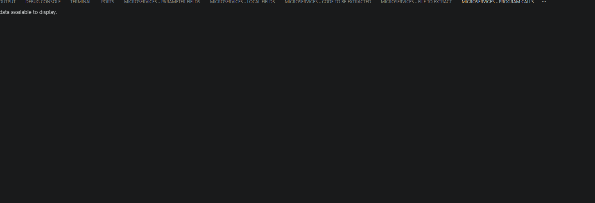

# Showing results

Once it is completed, you can have access to the detailed results of each extraction process.  
To do so, right-click on the extraction and select **Show Extraction Results** if the extraction was successful.

> [!TIP]
> **Lower-Panel Tabs (Version 1.0.4+)**  
> Extraction results are no longer displayed inside a sidebar tree (the previous **Extraction Analysis Explorer**). They now open as a row of Microservices tabs in the VS Code lower panel, next to **Output**, **Debug Console**, **Terminal**, and **Ports**: **Microservices - Parameter Fields**, **Microservices - Local Fields**, **Microservices - Code to be Extracted**, **Microservices - File to Extract**, and **Microservices - Program Calls**. Each tab keeps a list on the left and its **Usages** detail (and, where relevant, **I/O Runtime Paths**) on the right — the same information as before, now presented as flat, filterable tables instead of nested tree nodes.

## Microservices - Parameter Fields

Lists the parameters required for the extracted procedure (**Name**, **Type**, **Mode**, **Used in call**, **Description**), with a filter box and a **Show all usages** shortcut.

Selecting a parameter, or clicking **Show all usages**, populates the **Usages** panel on the right with **Status**, **Line**, **Usage**, and **No. of Runtime Paths**. Where a field is used along more than one execution path, the **I/O Runtime Paths** table underneath lists each **Path ID**, **Line**, **Instruction**, **Status**, and **Usage** — the information ARCAD Transformer Microservices uses to determine whether a parameter should act as Input, Output, or Input/Output in the extracted procedure.

## Microservices - Local Fields

Lists the local variables that remain within the extracted code (**Name**, **Type**, **Description**). The **Usages** panel is empty until a variable is selected.

Selecting a variable shows its usages (**Status**, **Line**, **Usage**, **No. of Runtime Paths**), the same detail level previously available by expanding the variable node in the tree.

## Microservices - Code to be Extracted

Shows the Code Fragments involved in the extraction as a compact tree (**Parts of code to be Extracted** → subroutine/section → fragment), with its **Partial**/**Complete** status and a description giving the line range and the number of calls not extracted.

## Microservices - File to Extract

Lists the additional source files involved in the extraction, when the analysis needs code from files other than the source being analyzed. **No data available to display** is shown when the extraction does not require any additional file.

## Microservices - Program Calls

Lists external program/procedure calls and dependencies referenced by the code being extracted (equivalent to the previous External Call view). **No data available to display** is shown when the extraction has no external calls.

> [!NOTE]
> The **Problems** view is unaffected by this change: analysis errors continue to be listed in the lower panel's **Problems** tab (see [Viewing errors](#viewing-errors) below). The underlying information is unchanged — only its presentation moved from a sidebar tree to lower-panel tabs, making the parameter, local field, code, file, and call details easier to view side by side.

## Procedure and Prototype

A procedure is a block of code that performs a task, and a prototype defines how a procedure can be called.

To open the declared procedure prototype,  right-click on a successful extraction and select **Show Extraction results**. Click the  More icon, then select the **Show Procedure Preview** option.

To open the declared procedure prototype,  right-click on a successful extraction and select **Show Extraction results**. Click the  More icon, then select the **Show Prototype Preview** option.

# Viewing errors

## Problems view

When an extraction analysis contains errors, they are displayed in the **Problems** view, which lists existing errors in an extracted code in the file and is always shown in the lower panel.

To display the details of the errors, right-click on the extraction and select **View Errors** if the extraction completed with errors.

The types of errors that are be displayed can include:

- incorrect selection of a conditional or control structure instruction,
- unresolved fields because the definition specification is not found in the source, or
- unresolved /COPY clause not available with the current library list.

If the **Problems** view contains multiple errors, you can double-click an error in the list to open it in the Editor at the corresponding line.
