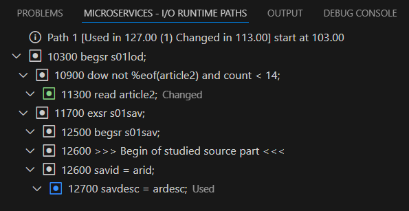
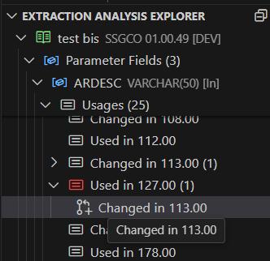
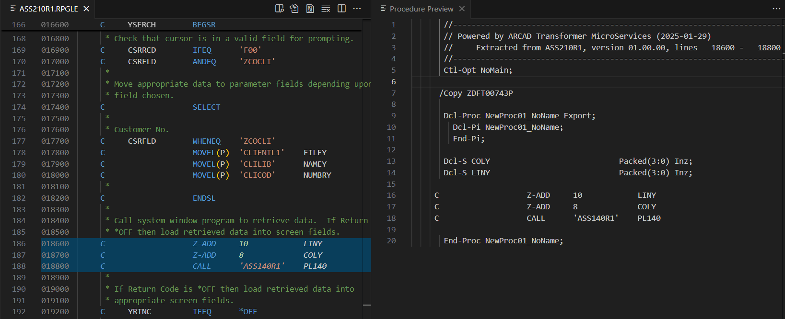
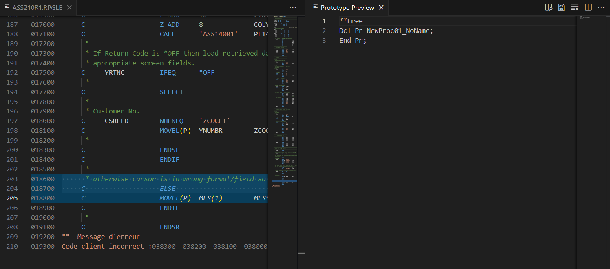
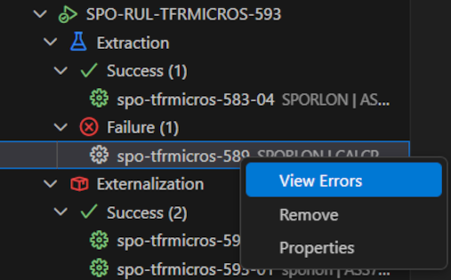
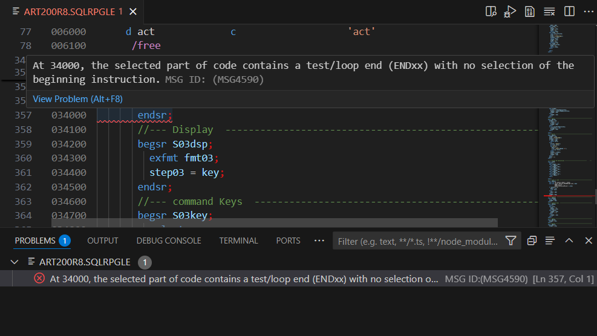

# Showing results

Once it is completed, you can have access to the detailed results of each extraction process.  
To do so, right-click on the extraction and select **Show Extraction Results** if the extraction was successful.

## Usage

Clicking on any **Extraction Analysis Explorer** component opens to its dedicated **Usage** page. 

Each element in the **Usage** view is color-coded and highlighted based on its type.  
When hovered over, a tooltip appears, providing contextual information for better guidance.

## Microservices I/O Runtime Path

The **Microservices I/O Runtime Path** view is an extension of the **Usage** section, designed to provide a detailed presentation of the results.

To display the information in the **Microservices I/O Runtime Path** view, right-click on a successful extraction and select **Show Extraction results**.
Unfold the **Extraction Analysis Explorer** section, spot the changes with a red icon, and click on the  icon.

## Procedure and Prototype

A procedure is a block of code that performs a task, and a prototype defines how a procedure can be called.

To open the declared procedure prototype,  right-click on a successful extraction and select **Show Extraction results**. Click the  More icon, then select the **Show Procedure Preview** option.

To open the declared procedure prototype,  right-click on a successful extraction and select **Show Extraction results**. Click the  More icon, then select the **Show Prorotype Preview** option.

# Viewing errors

## Problems view

When an extraction analysis contains errors, they are displayed in the **Problems** view, which lists existing errors in an extracted code in the file and is always shown in the lower panel.

To display the details of the errors, right-click on the extraction and select **View Errors** if the extraction completed with errors.

The types of errors that are be displayed can include:

- incorrect selection of a conditional or control structure instruction,
- unresolved fields because the definition specification is not found in the source, or
- unresolved /COPY clause not available with the current library list.

If the **Problems** view contains multiple errors, you can double-click an error in the list to open it in the Editor at the corresponding line.
