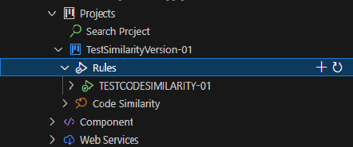
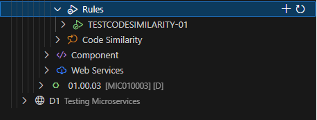
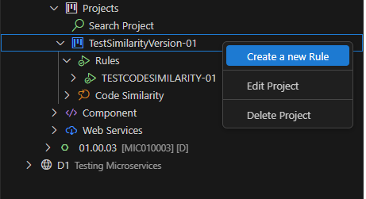
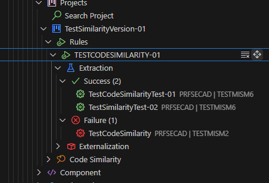
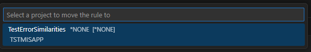
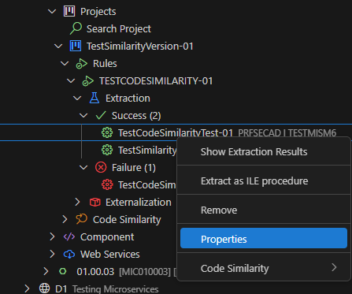
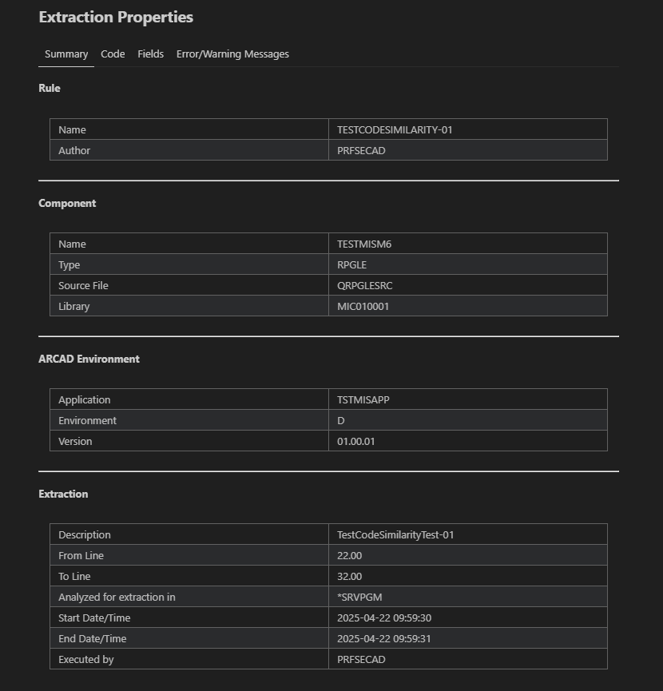
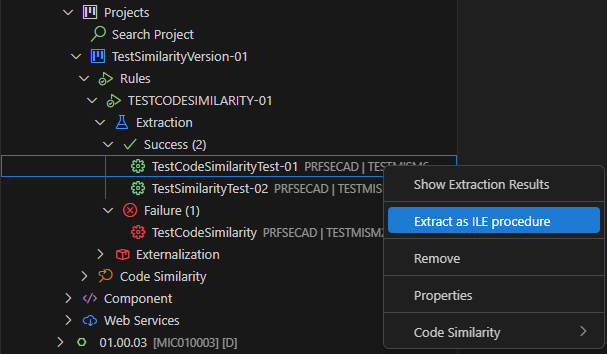
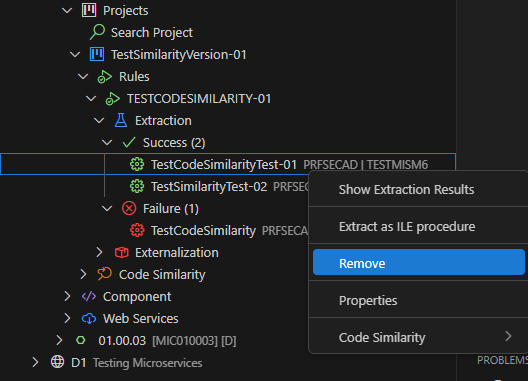
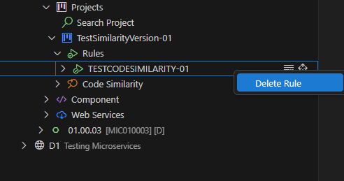

# Rules in ARCAD Transformer Microservices

In ARCAD Transformer Microservices, the **Rules** represent business logic that should be extracted and reused by other components.

Each rule links to an extraction analysis associated with a business rule, enabling reuse and externalization.

> [!NOTE]
> Each rule is **imperatively** linked to a single ARCAD Transformer Microservices Project.

Rules can be accessed and managed from the **Rules** node.  
To access this view, expand the **Rules** node under the **Projects** node located within both the **Repository** and **Version** nodes.

## OSGI Configuration (Version 1.0.3+)

OSGI (Open Service Gateway Initiative) configuration is essential for establishing proper connection management in ARCAD Transformer Microservices.

### Configuring OSGI Entities

| Entity Name | Purpose | Level|
| --- | --- | --- |
| `Microservices.ccsid` | Manages character set identifier settings for microservices connections | Application level |

**To Configure the OSGI Settings:**

**Step 1** Navigate to the **Application** node in your rule configuration and locate the OSGI configuration section.

**Step 2** Add or modify the `Microservices.ccsid` entity with the appropriate values for your environment.

**Step 3** Save your configuration.

**Result** Your OSGI settings are now applied at the **Application** level for all rules.

## License Management (Version 1.0.3+)

ARCAD Transformer Microservices now provides comprehensive license management with support for both temporary and permanent licenses.

### Viewing Available Licenses

Users can view and manage two types of licenses:

| Temporary Licenses | Permanent Licenses |
| ------- | -------- |
| - Short-term licenses for evaluation or trial purposes   - Indicated by temporary status in license details   - Useful for testing new features or environments | - Long-term production licenses   - Appropriate for permanent deployments   - Permanent status indicated in license details |

To View the License Information, open the **License Management** section from the Main menu or Settings.  
The system displays both:
- **Active Temporary Licenses** (if available)
- **Active Permanent Licenses** (if available)

> [!NOTE]
> Review the key information:
> - License type (`Temporary` or `Permanent`)
> - Expiration date (for temporary licenses)
> - Associated features and capabilities

## Creating a New ARCAD Transformer Microservices Rule

Follow the subsequent steps to create a new rule.

**Step 1** Click the **Create a new rule** icon or right-click on the **Project** and select the **Create a new rule** option.

  

**Step 2** Enter a unique **Name** for the new rule. This field is mandatory.

Press **Enter** to proceed.

**Step 3** Choose an existing **Project** from the list, or create a new one.

> **Reference**  
> For more information about Projects, refer to the [Creating a new ARCAD Transformer Microservices Project](project.md) documentation.

Press **Enter** to confirm.

**Result** The new rule appears in the list under the **Rules** node.

## Moving an Existing ARCAD Transformer Microservices Rule

Follow the subsequent steps to move an existing rule to a different project.

**Step 1** Initiate the move by clicking the **Move rule** icon from the inline toolbar on the rule node.

**Step 2** Select a Target Project from the ones available in the drop-down list.

**Result** The rule is successfully moved and will now appear under the **Rules** node of the selected project.

## Working with an Extraction Analysis

### Viewing Extraction Analysis Properties

In the **Microservices Rules Editor**, each extraction analysis provides detailed insights.  
You can view:

- General execution information in the **Summary** tab
- All code parts to be extracted in the **Codes** tab
- Parameters and local fields in the **Fields** tab
- Error and warning messages in the **Errors/Warning messages** tab
- Externalization details in the **ILE Procedure** tab (visible only after externalization)

**Step 1:** From the **Extraction** section in the **Rules** node, right-click on an extraction analysis.

**Step 2:** Select the **Properties** option from the contextual menu.

  

### Renaming an Extraction Analysis

You can update the description of extraction analyses to provide meaningful context and track changes. This action is available for both successful and failed extractions.

**Step 1:** From the **Extraction** or **Externalization** section in the **Rules** node, right-click on an extraction analysis.

**Step 2:** Select the **Rename** option from the contextual menu.

**Step 3:** Enter the new description for the extraction.

Press **Enter** to confirm.

> **Reference**  
> For more information about renaming extraction descriptions, refer to the [Rename Extraction](rename-extraction.md) documentation.

### Externalizing an Extraction Analysis

From the **Extraction** section in the **Rules** node, any successful extraction from a version can be externalized into a new ILE procedure.

> **Reference**  
> For more information about Externalization, refer to the [Externalization](externalisations.md) documentation.

### Launching a Code Similarity Search

You can search for similar code blocks from an existing extraction analysis.  
To do so, right-click on the analysis and select the **Code Similarity > Search for similar code** option.

> **Reference**  
> For more information about Code Similarity, refer to the [Code Similarity](codesimilarity.md) documentation.

### Deleting an Extraction Analysis

> [!WARNING]  
> Deleted extraction analyses **cannot** be recovered.

To delete an extraction analysis, right-click on the extraction analysis to delete from the **Extraction** or **Externalization** section and click the **Remove** option to confirm deletion.

## Deleting an ARCAD Transformer Microservices Rule

> [!WARNING]  
> Deleted rules **cannot** be recovered.

To delete a rule, click the **Delete rule** icon next to the rule you want to remove.

Click **OK** to confirm or **Cancel** to keep the rule.
