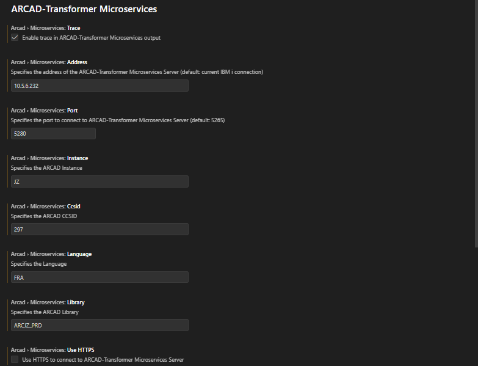
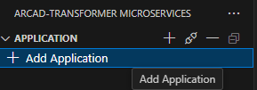
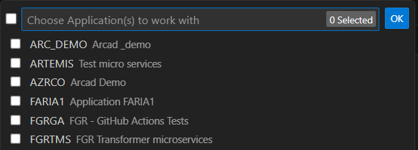
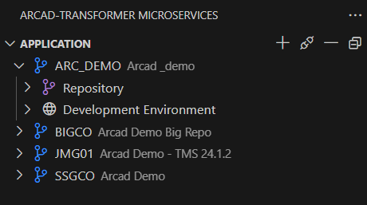
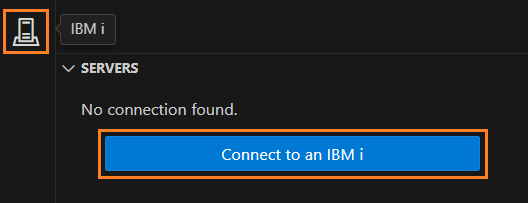
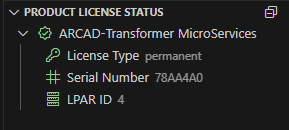
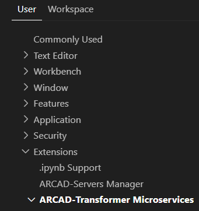

# Connecting to your Server

The connection to an active server is mandatory to use the features of the Transformer Microservices extension.

---

## Microservices Configuration

Before connecting to your IBM i server, you should configure your Microservices settings and add the applications you will work with.

### Microservices Initial Setup

Once you install the ARCAD Transformer Microservices extension, you'll need to configure it before establishing the server connection.

**Key Configuration Areas:**
- Application selection
- Server connection parameters
- License management
- Port and connection settings

### Adding an Application

Once the server is connected, you can open the Microservices extension to use its features.  
Before you start, you need to set the application(s) you will work with.

**Step 1:** Click on the **+** button in the **Application** section of the extension.

**Step 2:** A dialog opens showing available applications. Select one or several applications by checking their corresponding boxes.

**Available Applications** may include:
- ARC_DEMO - Arcad demo applications
- ARTEMIS - Test micro services
- AZRCO - Arcad demo applications
- FARIA1 - Application FARIA1
- FGRGA - FGR - GitHub Actions Tests
- FGRIMS - FGR Transformer microservices

**Step 3:** Click **OK** to add the selected applications.

**Result:** Your applications are successfully added and appear in the **Application** section in the primary panel view of the **Transformer Microservices** extension.

### Removing an Application

To remove an application from your workspace:

**Step 1** Click the **— Remove Application** button.

**Step 2** Select the applications to remove from the drop-down list.

**Step 3** Click **OK** to confirm the removal.

**Result** The application(s) are removed from your workspace and will no longer appear in the Application section.

---

## IBM i server connection

**Step 1:** To connect to your server, use the **IBM i** icon on the left side, then click on the **Connect to IBM i** button.

**Step 2:** Set the connection parameters:

**Connection Name** / **Host or IP Adress**  
Enter the name, Host or IP address of the IBM i partition hosting the server.

**Username** / **Password**  
Enter a valid user login and password. This user must be declared on the server and will be the user that will execute any operations on the IBM i.  
Check the **Save password** if needed.

**Step 3:** You can either click on the **Connect** button to connect immediately, or the **Save & Exit** button to connect later.

**Result:** You are successfully connected to the server.

The Transformer Microservices license is stored on the connected IBM i machine, so there is no need to add one within the extension.  
You can find the details in the **Product License Status** section in the primary panel view.

## Additional Configuration

Click the  Gear icon, then click the **Settings** option. The VScode settings open in a new tab.  
From the **Extensions** section, open the ARCAD-Transformer Microservices extension settings.

Check the **Enable trace in ARCAD-Transformer Microservices output** box to populate the Output view for get the logs and trace the steps of the process.

Set the **Port Number** used to connect to the ARCAD-Transformer Microservices Server.  
By default, the server used is **5265**.  

It is possible to use a secure connection (**HTTPS**), make sure to set the path to a local file containing the server's certificate chain in PEM format. Add a `0` at the end of your port number when using HTTPS.

The **Field Usages Coloring** settings section allows you to customize the visual presentation of your returned results, enhancing clarity and differentiation for better readability.
