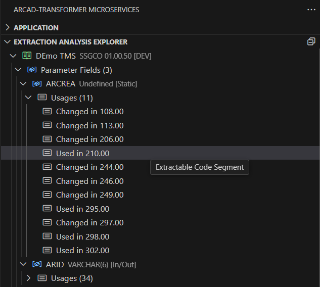
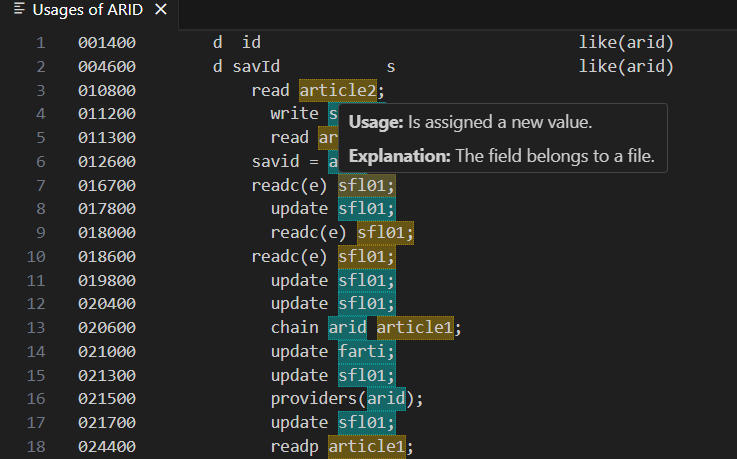

# Usage

Clicking on any **Extraction Analysis Explorer** component opens to its dedicated **Usage** page. 

Each element in the **Usage** view is color-coded and highlighted based on its type.  
When hovered over, a tooltip appears, providing contextual information for better guidance.

