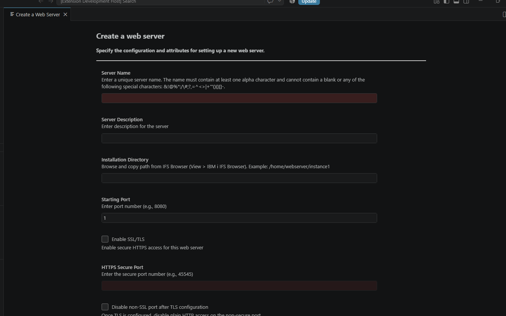
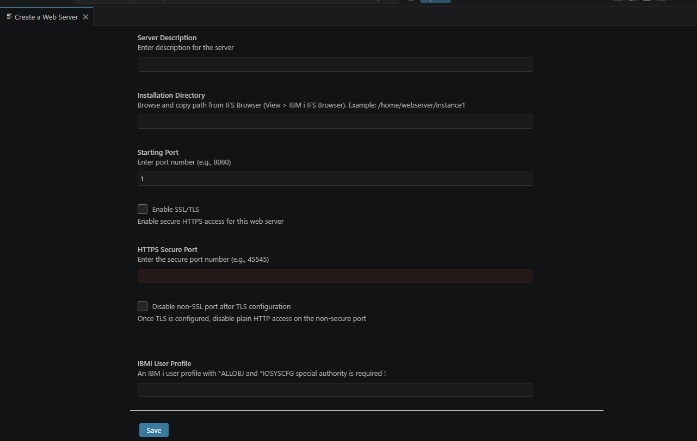
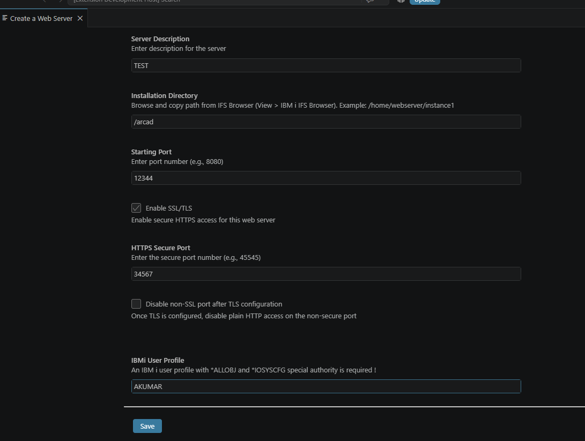
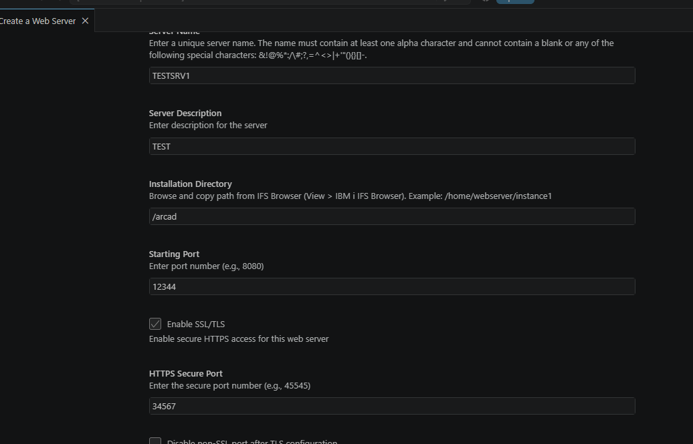
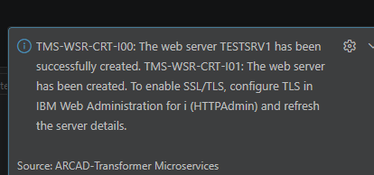

## Web Services Servers

*Web server management* is a pivotal feature in ARCAD Transformer Microservices, enabling the creation and management of web services.  
This feature optimizes the process of setting up web servers, making it more efficient and significantly reducing the time required to configure them.

> [!NOTE]  
> This feature is limited to management actions pertinent to ARCAD Transformer Microservices functionalities. Additionally, certain operations may experience minor delays.

---

## Web Server Management

Web server management in ARCAD Transformer Microservices uses **QShell commands** from the IBM i Integrated Web Services server.  
These commands, located in the `/QIBM/ProdData/OS/WebServices/bin` directory, are executed by the AFS server.

The following commands are used:

- `createWebServicesServer.sh` - Creates a web services server.
- `deleteWebServicesServer.sh` - Deletes a web services server.
- `getWebServicesServerProperties.sh` - Retrieves web server properties.
- `listWebServicesServers.sh` - Lists all available web servers.
- `startWebServicesServer.sh` - Starts a web server.
- `stopWebServicesServer.sh` - Stops a web server.

Web servers managed by ARCAD Transformer Microservices are accessed and managed in the **ARCAD-Microservices** explorer view under the **Web Servers** node.

---

### Creating a New Web Server

Follow the subsequent steps to create a new web server.

**Step 1** Click the **+** icon from the **Web Servers** node and select the **Create new web server** option.

**Step 2** Define the required attributes for the web server to be created, using the Wizard.

The **Create a Web Server** panel accepts the following parameters:

| Parameter | Description |
|---|---|
| Server Name | Mandatory, unique, maximum length 10 characters, must contain at least one alpha character, cannot contain a blank, and cannot contain the special characters `& ! @ % * : / \\ # ; ? , = ^ < > \| + ' " ( ) { } [ ] -`. |
| Server Description | Optional free-text label. |
| Installation Directory | Must be an existing IFS directory; can be browsed and copied from the IFS Browser (**View > IBM i IFS Browser**). |
| Starting Port | Must be between 1 and 65535. |

#### Enabling SSL/TLS (Version 1.0.4+)

Scroll down to enable secure HTTPS access for the web server:

| Parameter | Description |
|---|---|
| Enable SSL/TLS | Marks the server for secure HTTPS access and activates the **HTTPS Secure Port** field. |
| HTTPS Secure Port | Must be between 1 and 65535; only meaningful once **Enable SSL/TLS** is checked. |
| Disable non-SSL port after TLS configuration | Once TLS is configured, disables plain HTTP access on the non-secure port. |
| IBMi User Profile | An IBM i user profile with `*ALLOBJ` and `*IOSYSCFG` special authority is required. |

> **Example**  
> Server Description = `TEST`, Installation Directory = `/arcad`, Starting Port = `12344`, Enable SSL/TLS checked, HTTPS Secure Port = `34567`, IBMi User Profile = `AKUMAR`.

> [!WARNING]
> **Prerequisite - Configure TLS on IWS**  
> Checking **Enable SSL/TLS** and setting an **HTTPS Secure Port** in the Create Web Server form only records the intent and reserves the secure port on the web server object — it does **not** by itself activate TLS. TLS must be configured on the IBM i side first, in **IBM Web Administration for i** (HTTPAdmin / IWS), before it can be relied on here.

**Step 3** Click **Save** to complete the creation of the Web Service.

**Result** A confirmation notification is displayed in the VSCode notification area. If SSL/TLS was enabled, the notification reminds you that TLS must still be configured in IBM Web Administration for i.

> [!NOTE]  
> Once the web server is created, a corresponding entity is added in ARCAD Transformer Microservices, which becomes the primary interface for further interactions.

---

### Starting and Stopping a Web Server

Follow the subsequent steps to start or stop an existing web server.

**Step 1** From the **ARCAD-Microservices** view, expand the **Web Servers** node.

**Step 2** Select one of the following options from the menu:

- **Start web server**  
    
- **Stop web server**  
    

**Step 3** Click the **Refresh** icon in the Toolbar of the **Web Servers** node to update the view.

> [!WARNING] 
> Starting or stopping a web server also triggers the same action for all web services hosted on that server.

---

### Deleting a Web Server

> [!WARNING]  
> Deleting web servers cannot be recovered.  
It also removes all related web services and their references from both your IBM i system and ARCAD Transformer Microservices.

Follow the subsequent steps to delete an existing web server.

**Step 1** From the **ARCAD-Microservices** view, expand the **Web Servers** node.

**Step 2** Right-click on the web server to delete.

**Step 3** Select the **Delete web server** option from the contextual menu.

Click **OK** to confirm.

---

### Viewing Web Server Properties

To view the properties of an existing web server, follow these steps:

**Step 1** Navigate to the **ARCAD-Microservices** view and expand the **Web Servers** node.

**Step 2** Locate the desired web server, right-click on it, and select **Properties** from the contextual menu.

**Step 3** A detailed properties panel will open, displaying the configuration and status of the selected web server.

> **Reference** 
> For more information, refer to the [Integrated Web Services Server Administration and Programming Guide](https://public.dhe.ibm.com/systems/support/i/iws/systems_i_software_iws_pdf_WebServicesServer_new.pdf).
