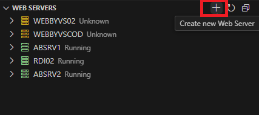
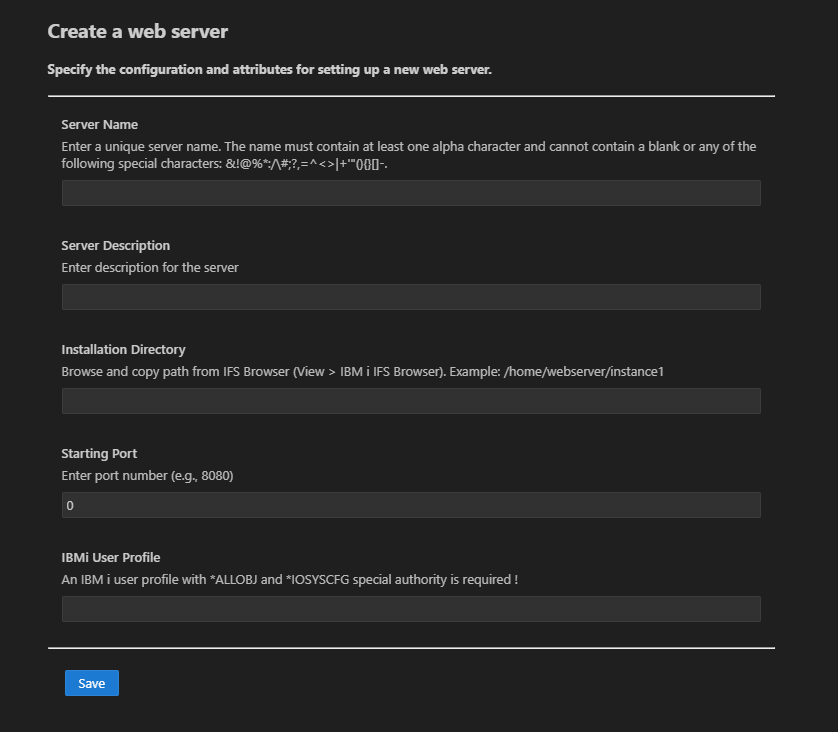
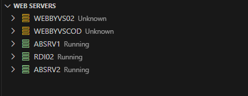
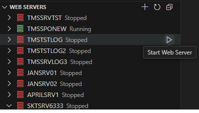
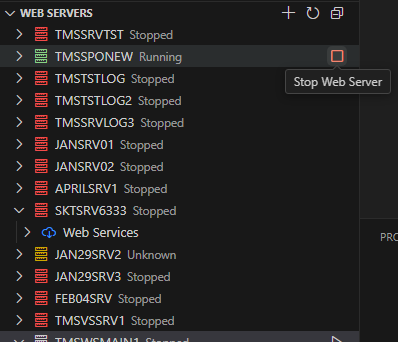
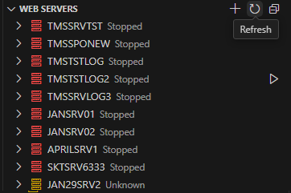
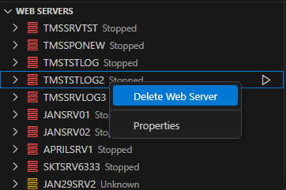
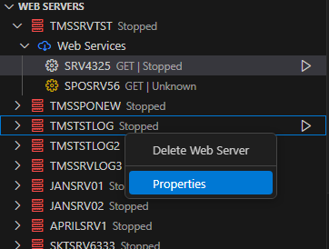
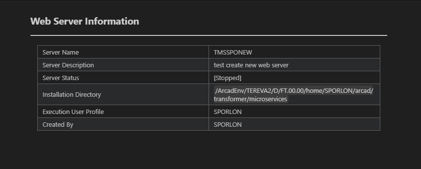

## Web Services Servers

*Web server management* is a pivotal feature in Transformer Microservices, enabling the creation and management of web services. This feature optimizes the process of setting up web servers, making it more efficient and significantly reducing the time required to configure them.

> [!NOTE]  
> This feature is limited to management actions pertinent to Transformer Microservices functionalities. Additionally, certain operations may experience minor delays.

---

## Web Server Management

Web server management in Transformer Microservices uses **QShell commands** from the IBM i Integrated Web Services server. These commands, located in the directory `/QIBM/ProdData/OS/WebServices/bin`, are executed by the AFS server.

The following commands are used:

- `createWebServicesServer.sh` - Creates a web services server.
- `deleteWebServicesServer.sh` - Deletes a web services server.
- `getWebServicesServerProperties.sh` - Retrieves web server properties.
- `listWebServicesServers.sh` - Lists all available web servers.
- `startWebServicesServer.sh` - Starts a web server.
- `stopWebServicesServer.sh` - Stops a web server.

Web servers managed by Transformer Microservices are accessed and managed in the **ARCAD-Microservices** explorer view under the **Web Servers** node.

---

### Creating a New Web Server

Follow these steps to create a new web server:

1. Click the **+** icon from the **Web Servers** node and select **Create new web server**.

    

2. Using the assistant, define the required attributes for the web server to be created.

    

3. Click **Save** to complete the setup.

> [!NOTE]  
> Once the web server is created, a corresponding entity is added in Transformer Microservices, which becomes the primary interface for further interactions.

---

### Starting and Stopping a Web Server

Follow these steps to start or stop an existing web server:

1. From the **ARCAD-Microservices** view, expand the **Web Servers** node.

    

2. Select one of the following options from the inline menu:

    - **Start web server**  
      
    - **Stop web server**  
      

3. Click the **Refresh** icon in the View Toolbar of the **Web Servers** node to update the view.

    

> **Important:**  
> Starting or stopping a web server also triggers the same action for all web services hosted on that server.

---

### Deleting a Web Server

> [!WARNING]  
> Deleting a web server is **irreversible** and also removes all related web services and their references from both your IBM i system and Transformer Microservices.

Follow these steps to delete an existing web server:

1. From the **ARCAD-Microservices** view, expand the **Web Servers** node.

2. Right-click on the web server you wish to delete.

3. Select **Delete web server** from the contextual menu.

    

4. Confirm the action to be performed.

---

### Viewing Web Server Properties

To view the properties of an existing web server, follow these steps:

1. Navigate to the **ARCAD-Microservices** view and expand the **Web Servers** node.

    

2. Locate the desired web server, right-click on it, and select **Properties** from the contextual menu.

    

3. A detailed properties panel will open, displaying the configuration and status of the selected web server.

    

> **Reference:** 
> For further information, refer to the [Integrated Web Services Server Administration and Programming Guide](#).

