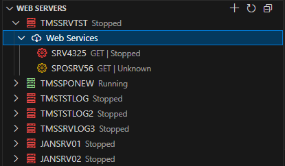
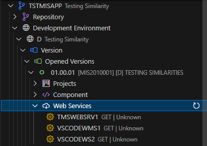
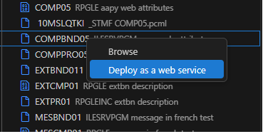
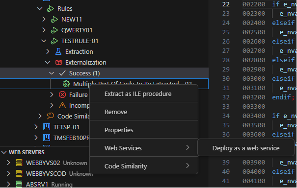
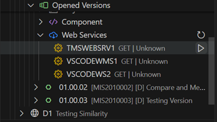

## 📚 Table of Contents
- [Deploy a Web Service](#deploy-a-web-service)
- [Web Services Management](#web-services-management)
- [Deploying a Web Service](#deploying-a-web-service)
- [Starting or Stopping a Web Service](#starting-or-stopping-a-web-service)
- [Updating a Web Service](#updating-a-web-service)
- [Deleting a Web Service](#deleting-a-web-service)
- [Viewing Web Service Properties](#viewing-web-serverice-properties)
- [Properties](#properties)
- [Swagger](#swagger)
- [Annexes](#annexes)

---

## Deploy a Web Service

*Web services management* functionality offers a centralized management approach to simplify both generation and deployment processes of REST web services for ILE programs or services programs generated with Transformer Microservices.

By taking advantage of several pieces of data generated during the process of externalizing a procedure, Transformer Microservices predefines a configuration of the future web service to be created.

---

## Web Services Management

Web Services management in Transformer Microservices uses **QShell commands** from the IBM i Integrated Web Services server. These commands, located in the directory `/QIBM/ProdData/OS/WebServices/bin`, are executed by the AFS server.

The following commands are used:

- `getWebServiceProperties.sh` – Retrieves web service properties.
- `installWebService.sh` – Installs web services.
- `listWebServices.sh` – Lists deployed web services.
- `startWebService.sh` – Activates stopped web services.
- `stopWebService.sh` – Deactivates active web services.
- `uninstallWebService.sh` – Removes web services.

Web services managed by Transformer Microservices can be accessed and managed from two locations:

- **ARCAD-Microservices Explorer View**: Expand the **Web Server** hosting the web services to view and manage them.  
    

- **Web Services (List)**: Located within each **Opened Version** under the **Development Version**.  
    

> [!IMPORTANT]  
> The system exclusively supports ILE objects, specifically ILEPGM and ILESRVPGM, created by ARCAD-Transformer Microservices.

> [!NOTE]   
> This feature is limited to management actions pertinent to Transformer Microservices functionalities. Additionally, certain operations may experience minor delays.

---

## Deploying a Web Service

Deploying a web service in ARCAD-Transformer Microservices involves a structured process that ensures efficient management and deployment.

<strong>Step-by-step: Deploy a Web Service</strong>

1. **Select an Entry Point**  
   - Select either:
     - an ILE object type ILEPGM or ILESRVPGM created by Transformer Microservices.  
       
     - or an extraction that has been successfully externalized.  
       

2. **Right-click "ARCAD Transformer Microservices > Deploy as Web Service"**  
   - The system runs the `AAPYWEBATR` command to generate a PCML file in the `/transformer/microservices/pcml` directory.
   - This ensures that PCML files are dynamically stored based on environment settings using the `AWRKENVIFS` command. The system also determines which module to insert `PGMINFO(*PCML) INFOSTMF(<IFS_directory>)` into the RPG source code.

3. **Configure REST and General Attributes**  
   - Use the assistant to fill in necessary fields.

4. **Click Finish**  
   - This completes the web service creation.
   - A corresponding entity is added, becoming the primary interface for future interactions.
   - The `.pcml` and `.properties` files will be added to your development version.

> [!NOTE]  
> The generated properties file adheres to IBM's syntax, allowing it to be used directly with IBM QShell.

### ⚙️ Configuring the URI Path

Each input parameter can be edited and must follow these rules:

**Path Parameters:**
- Must be declared first in the *URI path template for the resource* field.
- Each input parameter must match an existing identifier.

**Query Parameters:**
- Must be defined with both identifier and default value.

> [!NOTE]  
> Auto-completion of the URI is provided to showcase its full syntax.

---

## Starting or Stopping a Web Service

<strong>From the ARCAD Microservices View</strong>

1. **Expand the Web Server**  
   Select the web service from the inline menu.

2. **Start or Stop the Web Service**  
   Choose the appropriate option.  
   

3. **Refresh the View**  
   Use the **Refresh** icon in the View Toolbar.

> [!NOTE]   
> Upon successful execution, the entity is updated.

<strong>From the Version Web Services View</strong>

1. Expand the **Web Services** node under your **Opened Version**.

2. Select a web service and choose **Start** or **Stop** from the inline menu.  
   

3. Click **Refresh** in the View Toolbar.

> [!NOTE]  
> Upon successful execution, the entity is updated.

---

## Updating a Web Service

You should update the web service if:
- The procedure interface has changed.
- The REST attributes in the `.properties` file have changed.

<strong>From the ARCAD Microservices View</strong>

1. **Expand the Web Server** and right-click the web service.

2. **Select Update Option**  
   

3. **Specify the Updated Files** (`.properties` and `.pcml`)

4. **Click Finish** to complete the update.

<strong>From the Version Web Services View</strong>

1. Expand the **Web Services** node under your **Opened Version**.

2. Right-click the web service and select **Update web service**.  
   

3. Specify the updated `.properties` and `.pcml` files.  
   

4. Click **Save** to complete the process.

---

## Deleting a Web Service

> [!WARNING]  
> Deleting a web service is **irreversible** and removes all references from your system except the `.pcml` and `.properties` files.

<strong>From the ARCAD Microservices View</strong>

1. Expand the **Web Server** and right-click the web service.

2. Select **Delete web service**.  
   

3. Confirm the action.

4. Refresh the view.

<strong>From the Version Web Services View</strong>

1. Expand the **Web Services** node under your **Opened Version**.

2. Right-click the web service and select **Delete web service**.  
   

3. Confirm the action.

4. Click **Refresh** to update the list.

---

## Viewing Web Serverice Properties

<strong>From the ARCAD Microservices View</strong>

1. Expand the **Web Server** and right-click the web service.

2. Select **Properties**.  
   

3. Confirm the action.

4. Refresh the view.

<strong>From the Version Web Services View</strong>

1. Expand the **Web Services** node under your **Opened Version**.

2. Right-click the web service and select **Properties**.  
   

---

## Properties

---

## Swagger

---

## Annexes

>  **Reference**  
> For further information, refer to the [Integrated Web Services Server Administration and Programming Guide](https://www.ibm.com/docs/en/i/7.4?topic=guide-integrated-web-services-server-administration-programming).

